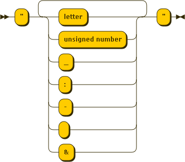

.. _details:

Some important details
----------------------

Working on a specific region
****************************

In the first examples, the positions are given by coordinates and no network is specified.

However when no coordinates are provided, you need to provide on what region you want to request.

The list of region covered by *navitia* are available at http://api.navitia.io/v0/regions.json . The shape of the region
is provided in `GeoJSON <http://www.geojson.org/geojson-spec.html>`_.

More about entry points
***********************

In the first example, we used coordinates. If you want to use any other point (e.g. a stop point), just
use its uri. The uri of the different objects are returned by APIs as proximity list.

You should not try to build an uri by yourself, but only re-use those provided by an API. The only
exceptions are coordinates that have the following syntax ``coord:lon:lat``.

.. _filter:

The filter parameter
********************

The filter argument used for requesting public transport object are defined by the grammar defined below. See the previous examples
:ref:`pt_introduction` to know how to use it.

**filter**

.. figure:: ptref_grammar/filter.png

**selector**

.. figure:: ptref_grammar/selector.png

**object**

.. figure:: ptref_grammar/object.png

**attribute**

.. figure:: ptref_grammar/attribute.png

**bin_op**

.. figure:: ptref_grammar/bin_op.png

**value**

.. figure:: ptref_grammar/value.png

**escaped_value**

