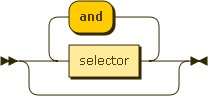
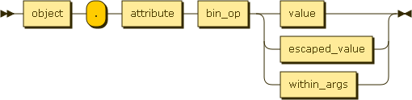

.. _filter:

The filter parameter
********************

The filter argument used for requesting public transport object are defined by the grammar defined below. See the previous examples
:ref:`pt_introduction` to know how to use it.

**filter**

**selector**

**object**

.. figure:: ptref_grammar/object.png

**attribute**

.. figure:: ptref_grammar/attribute.png

**bin_op**

.. figure:: ptref_grammar/bin_op.png

**value**

.. figure:: ptref_grammar/value.png

**escaped_value**

.. figure:: ptref_grammar/escaped_value.png

