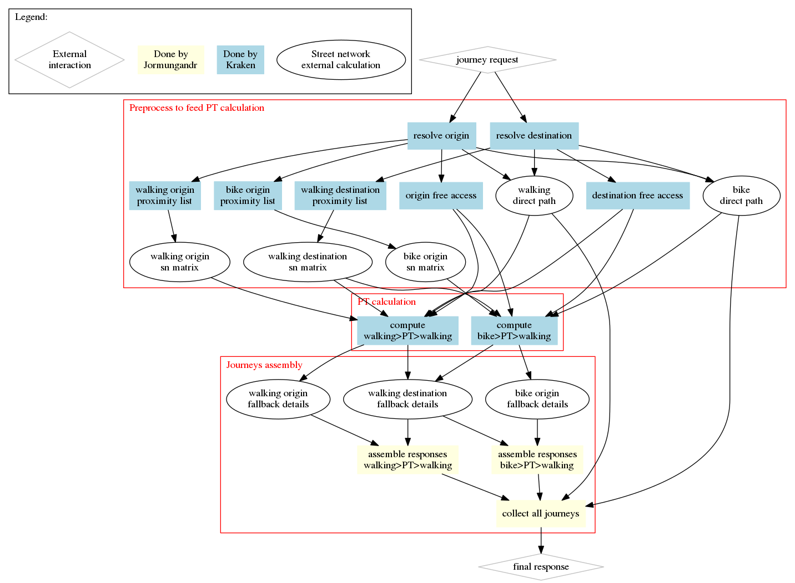
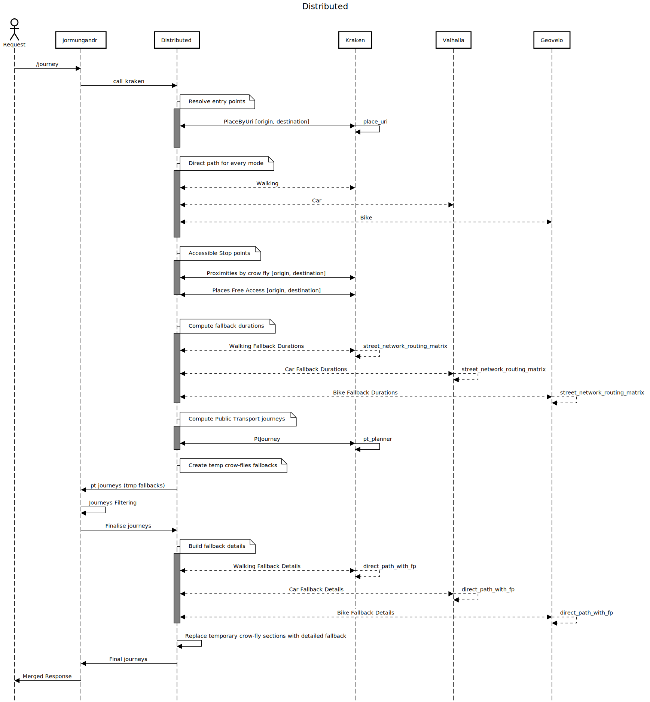

Scenario Distributed
====================

This scenario allows us to call multiple engines for computing fallbacks. These engines can be:

  - kraken
  - geovelo
  - here
  - valhalla

The orchestration is a bit complex, so this documentation will try to explain what is done, and in what order.
Each fallback mode can use a specific engine that is configured at the instance level.

First we search for the origin and destination objects with kraken.

Then, for each departure fallback mode, we compute the direct path between the origin and the destination with the
appropriate engine. This is done asynchronously.
If public transport is disabled (max_duration=0) jormungandr returns these results and stops.

Then, we start computing the stop points that can be reached for each mode at both extremities.
This is computed by kraken using a crowfly at constant speed.

While this is computing, we look for stop points that can be accessed in zero sec (typically the stop_points
of a stop_area). This might require a call to kraken in some cases.

The previous step will let us build a matrix of stop_points accessible per mode that will be updated with "real"
durations by using the configured streetnetwork engine and its matrix API.

At this point, we can start the public transport part of the algorithm. We will trigger the computation of each valid combination
of departure mode and arrival mode. To start it, we need:
  - the origin matrix
  - the destination matrix
  - the direct path

Kraken returns journeys that need to be completed by computing: 
 - a streetnetwork journey from the origin to the departure's stop_point of the first section 
 - another journey from the destination's stop_point of the last section to the destination.
 
Like others operations, this is done asynchronously as soon as we get a response from Kraken. If multiple journeys
use the same fallback journey, it will only be computed one time.

For instance, a request like—https://api.navitia.io/v1/coverage/fr-idf/journeys?from=stop_area%3AOIF%3ASA%3A59238&to=2.33071%3B48.83890&first_section_mode%5B%5D=bike&first_section_mode%5B%5D=walking&datetime=20180614T113500&last_section_mode%5B%5D=walking&, will produce the following calls.

Dependency graph:

Sequence diagram:

