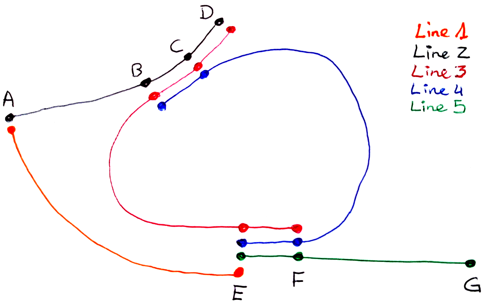

# Documentation of the routing algorithm

## The implemented algorithm

### Abstract

a quick view

### Example 1

Line 1 (every 20 minutes):

| A  | E  |
|----|----|
|7:50|8:50|
|8:10|9:10|
|8:30|9:30|

Line 2 (every 10 minutes):

| A  | B  | C  | D  |
|----|----|----|----|
|8:00|8:30|8:33|8:36|
|8:10|8:40|8:43|8:46|
|8:20|8:50|8:53|8:56|

Line 3 (every 5 minutes):

| D  | C  | B  | E  | F  |
|----|----|----|----|----|
|8:35|8:38|8:41|9:00|9:02|
|8:40|8:43|8:46|9:05|9:07|
|8:45|8:48|8:51|9:10|9:12|

Line 4 (every 5 minutes):

| B  | C  | F  | E  |
|----|----|----|----|
|8:35|8:40|9:00|9:02|
|8:40|8:45|9:05|9:07|
|8:45|8:50|9:10|9:12|

Line 5 (every 20 minutes):

| E  | F  |  G  |
|----|----|-----|
|9:05|9:07|10:00|
|9:25|9:27|10:20|
|9:45|9:47|10:40|

Connections: only intra stop point, 2 minutes except for F 3 minutes.

### RAPTOR and the specificities

The routing algorithm is build around RAPTOR, a routing algorithm developped at Microsoft and published in 2012. The paper can be found [here](https://www.microsoft.com/en-us/research/wp-content/uploads/2012/01/raptor_alenex.pdf).

Basically, you give to RAPTOR the set of journey patterns it can use, the set of stop points it can use (for transfers), the datetime you can reach the stop points and the direction. It gives you, for each stop points and each number of transfers, the earliest arrival datetime.

* datastructures
* stay in
* ITL
* Something else?

### The first pass on example 1

Starting from A at 7:45:

|level| A  | B  | C  | D  | E  | F  |  G      |
|-----|----|----|----|----|----|----|---------|
|TR0  |7:45|    |    |    |    |    |         |
|PT1  |    |8:30|8:33|8:36|8:50|    |         |
|TR1  |    |8:32|8:35|8:38|8:52|    |         |
|PT2  |    |    |    |    |    |9:00|**10:00**|
|TR2  |    |    |    |    |    |9:03|10:02    |
|PT3  |    |    |    |    |    |    |         |

Starting from A at 7:55:

|level| A  | B  | C  | D  | E  | F  |  G      |
|-----|----|----|----|----|----|----|---------|
|TR0  |7:55|    |    |    |    |    |         |
|PT1  |    |8:30|8:33|8:36|9:10|    |         |
|TR1  |    |8:32|8:35|8:38|9:12|    |         |
|PT2  |    |    |    |    |9:00|9:00|**10:20**|
|TR2  |    |    |    |    |9:02|9:03|10:22    |
|PT3  |    |    |    |    |    |    |**10:00**|
|TR3  |    |    |    |    |    |    |10:02    |
|PT4  |    |    |    |    |    |    |         |

### Second pass

* goal
* selecting the second pass launches (max_extra_second_pass)
* bounding the extra second passes
* reusing the bound of the first passes to limit the search space

### The second pass on example 1

Leaving G at 10:00:

|level| A      | B  | C  | D  | E  | F  |  G  |
|-----|--------|----|----|----|----|----|-----|
|TR0  |        |    |    |    |    |    |10:00|
|PT1  |        |    |    |    |9:05|9:07|     |
|TR1  |        |    |    |    |9:03|9:04|     |
|PT2  |**7:50**|8:41|8:40|8:35|    |    |     |
|TR2  |7:48    |8:39|8:38|8:33|    |    |     |
|PT3  |**8:00**|    |    |    |    |    |     |
|TR3  |7:58    |    |    |    |    |    |     |
|PT4  |        |    |    |    |    |    |     |

### Solution reader

* goal
* the objectives
* the search space
* the branching scheme

### Advantages and drawbacks

advantages:
* diversity
* performance
* flexibility

drawbacks:
* not exact walking objective
* difficulty to add objectives
* RAPTOR variants quite complex and not really combinable

## Some ideas for improvement

* RAPTOR, CSA and others
* objectives
