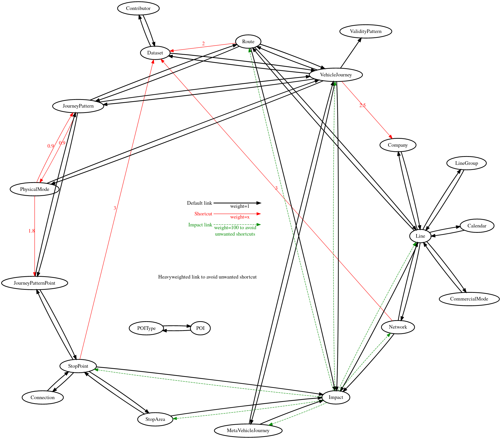

# Public Transit Referential grammar

It's possible to do advanced query to the public transit referential. The query is in the form `/v1/coverage/id/collections?filter=query`. This is the documentation of the `collections` and `query` syntax. `query` must be urlencoded in practice, but for simplicity it is not the case in this documentation.

Each query is composed of 2 parts: the collection to be asked (`collections` in the example), and the query itself that describe the wanted objects.

The valid collections are `commercial_modes`, `companies`, `connections`, `contributors`, `datasets`, `disruptions`, `journey_patterns`, `journey_pattern_points`, `lines`, `networks`, `physical_modes`, `poi_types`, `pois`, `routes`, `stop_areas`, `stop_points` and `vehicle_journeys`.

The `traffic_reports` endpoint builds its response on the `networks` collection.

The `line_reports` endpoint builds its response on the `lines` collection.

The `route_schedules` endpoint builds its response on the `routes` collections.

The `arrivals`, `departures` and `stop_schedules` endpoint builds their responses on the `journey_pattern_points` collection.

## Predicates

The elementary building block of a query is the predicate. It defines a set of requested objects.

### Elementary predicates

There are 2 elementary predicates: `all` and `empty`. As expected, `all` returns all the queried objects while `empty` returns none.

Examples:
 * `/v1/coverage/id/stop_areas?filter=all`: returns all the stop areas of the coverage.
 * `/v1/coverage/id/stop_areas?filter=none`: returns 0 stop areas (you get a 404).

### Method predicates

Method predicates are in the form `collection.method(string, string, ...)` where:
 * `collection` is a collection name (as the collections queried, but singular);
 * `method` is a method name, corresponding to the filter on the `collection`;
 * arguments to the method between `(` and `)`, as strings, separated by `,`.

Example: `/v1/coverage/id/stop_areas?filter=stop_area.has_code("neptune","1242")`

#### Strings

A string can be:
 * an escaped string, beginning and ending with `"`, with `\x` transformed as `x` within the string
 * a basic string, composed of any letter, digit, `_`, `.`, `:`, `;`, `|` and `-`.

Basic strings are great to easily type numbers and navitia coordinates. It can also handle most of the identifiers, but be warned that you will run into troubles if you use the basic string syntax in a programmatic way (think of identifiers with spaces or accentuated letters).

For programatic usage, it is recommended to:
 * substitute `\` by `\\`
 * substitute `"` by `\"`
 * surround the string with `"`

Examples:
 * `1337`
 * `-42`
 * `-123.45e-12`
 * `2.37715;48.846781`
 * `"I can have spaces and accentuated letters: éèà"` (decoded as `I can have spaces and accentuated letters: éèà`)
 * `"a \" and a \\ within a string"` (decoded as `a " and a \ within a string`)

#### Availlable methods

In the following table, if the invocation starts with `collection`, any collection can be used, else the method will only work for the specified collection.

| query | signification | note |
|-------|---------------|------|
|`collection.has_code(type, value)`|all the objects of type `collection` that have the code `{type: "type", value: "value"}` in `codes[]`|only the `codes[]` field is used|
|`collection.has_code_type(type1, type2, ...)`|all the objects of type `collection` that have any of the specific types `{type: "type1"}` in `codes[]`|only the `codes[]` field is used|
|`collection.id(id)`|the object of type `collection` that have `id` as identifier (empty if this identifier is not present)|for types without identifier (as `connection`), it is equivalent to `empty`|
|`collection.uri(id)`|same as `collection.id(id)`|deprecated|
|`collection.name(name)`|all the objects of type `collection` that have `name` as name|for types without name (as `connection`), it is equivalent to `empty`|
|`disruption.tag(tag)`|all the disruptions containing the given tag|equivalent to `disruption.tags(tag)`|
|`disruption.tags(tag1, tag2, ...)`|all the disruptions containing at least one of the given tags|at least one tag must be given|
|`disruption.between(since, until)`|all the disruptions that are active during the `[since, until]` period|`since` and `until` must be UTC datetime in the ISO 8601 format (ending with `Z`)|
|`disruption.since(since)`|all the disruptions that are active after the given datetime|as above|
|`disruption.until(until)`|all the disruptions that are active before the given datetime|as above|
|`vehicle_journey.between(since, until, data_freshness)`|all the vehicle journeys that start during the `[since, until]` period|`since` and `until` must be UTC datetime in the ISO 8601 format (ending with `Z`) Additional `data_freshness` parameter allows to get only the vehicle journeys valid for the data freshness level requested (`base_schedule`, `adapted_schedule`, `realtime`)|
|`vehicle_journey.since(since, data_freshness)`|all the vehicle journeys that start after the given datetime|as above|
|`vehicle_journey.until(until, data_freshness)`|all the vehicle journeys that start before the given datetime|as above|
|`vehicle_journey.has_disruption()`|all the vehicle journeys containing at least a disruption ||
|`vehicle_journey.has_headsign(headsign)`|all the vehicle journeys containing the given headsign ||
|`line.code(code)`|all the lines containing the given code|this predicate use the field `line.code`, not `line.codes[]`|
|`line.odt_level(level)`|all the lines with the given on demand transport property|level can be `scheduled`, `with_stops` or `zonal`|
|`poi.within(distance, coord)`|all the POIs within `distance` meters from `coord`|`distance` in a positive integer, `coord` is a navitia coord (`lon;lat`)|
|`stop_area.within(distance, coord)`|as above for the stop areas|as above|
|`stop_point.within(distance, coord)`|as above for the stop points|as above|

#### Interpretation

Each predicate correspond to a set of object of a given type, but the request might be from another type. In this case, the request will return the objects corresponding to the set of objects described by the predicate.

For example, if you have the request `/v1/coverage/id/lines?filter=stop_area.name("Mairie")`, you first get the set of the stop areas with "Mairie" as name, and then returns all the lines that pass by these stop areas.

### Field test predicates

As a short hand, every method with exactly one parameter of the form `collection.method(param)` can be rewritten as `collection.method = param` (with or without spaces around `=`).

Examples:
 * `stop_area.id("foo")` can be written `stop_area.id = "foo"`
 * `line.code(14)` can be written `line.code=14`

### DWITHIN predicate

For backward compatibility, `collection.within(distance, lon;lat)` can be written `collection.coord DWITHIN(lon, lat, distance)`. This syntax is deprecated and might disapear in a futur release.

## Expressions

Expressions allow to combine predicates. There are 3 different operators:
 * `AND` (or `and`): returns the intersection between the 2 predicates
 * `OR` (or `or`): returns the union between the 2 predicates
 * `-`: returns the set difference between the 2 predicates

 ### `AND`

 `/v1/coverage/id/collections?filter=pred1 and pred2` is equivalent to take the objects in common between `/v1/coverage/id/collections?filter=pred1` and `/v1/coverage/id/collections?filter=pred2`.

 Examples:
 * `/v1/coverage/id/stop_areas?filter=network.id=RATP and physical_mode.id=physical_mode:Bus` returns the stop areas where buses of the network RATP stop.
 * `/v1/coverage/id/lines?filter=stop_area.name=Nation and stop_area.name="Charles de Gaulle Etoile"` returns the lines that stop at Nation and Charles de Gaulle Etoile.
 * `/v1/coverage/id/lines?filter=line.code=14 and physical_mode.id=physical_mode:Metro` returns the metro lines with code 14.

 ### `OR`

 `/v1/coverage/id/collections?filter=pred1 or pred2` is equivalent to take the objects that appear in `/v1/coverage/id/collections?filter=pred1` or in `/v1/coverage/id/collections?filter=pred2`.

 Examples:
 * `/v1/coverage/id/pois?filter=poi.id=foo or poi.id=bar` returns the pois `foo` and `bar` (if they exists).
 * `/v1/coverage/id/stop_areas?filter=line.code=A or line.code=B` returns the stop areas where line A or line B stop.
 * `/v1/coverage/id/lines?filter=physical_mode.id=physical_mode:Metro or network.id=SNCF` returns the SNCF lines and the Metro lines.

 ### `-`

 `/v1/coverage/id/collections?filter=pred1 - pred2` is equivalent to take the objects that appear in `/v1/coverage/id/collections?filter=pred1` and remove the objects that appear in `/v1/coverage/id/collections?filter=pred2`.

 Examples:
 * `/v1/coverage/id/physical_modes?filter=all - physical_mode.id=physical_mode:Bus` returns all the physical modes except Bus.
 * `/v1/coverage/id/lines?filter=network.id=SNCF - physical_mode.id=physical_mode:Bus` returns the lines from the network SNCF that don't have buses.
 * `/v1/coverage/id/lines?filter=physical_mode.id=physical_mode:Metro - stop_area.name=Nation` returns the metro lines that don't stop at Nation.

 ### Combining expressions

 You can combine operators to create more complicated expressions. The priorities of the operators are chosen to feel natural to programmers: `-`, `AND`, `OR` is the priority order. Their associativity are left to right. Parenthesis can be used to change this order (or remove ambiguities).

|without parenthesis|equivalent to|
|-------------------|-------------|
|`pred1 and pred2 or pred3 and pred4`|`(pred1 and pred2) or (pred3 and pred4)`|
|`pred1 - pred2 - pred3`|`(pred1 - pred2) - pred3`|
|`pred1 or pred2 - pred3 and pred4 or pred5`|`(pred1 or ((pred2 - pred3) and pred4)) or pred5`|

 Examples:
 * `/v1/coverage/id/lines?filter=physical_mode.id=physical_mode:Metro - stop_area.name=Nation - stop_area.name="Charles de Gaulle Etoile"` returns the metro lines that don't stop at Nation or Charles de Gaulle Etoile. Can also be written `/v1/coverage/id/lines?filter=physical_mode.id=physical_mode:Metro - (stop_area.name=Nation or stop_area.name="Charles de Gaulle Etoile")`
 * `/v1/coverage/id/lines?filter=stop_area.name=Nation and stop_area.name="Charles de Gaulle Etoile" - (stop_area.name=Bastille or stop_area.name=Corvisart)` returns the lines that stop at Nation and Charles de Gaulle Etoile but not at Bastille nor Corvisart.

## Sub request

Method predicates allow you to request for a set of object of a given type, and then getting the corresponding objects of another type. Sub request allows you to chain such a pattern. Imagine you want to list the line of the same network of a given line. First, you want to get the networks corresponding to the given line, and then getting the corresponding lines from these networks.

The syntax is `get collection <- expression`. It is lower priority than the operators and its associativity is right to left. It can be used as a predicate (`(get collection <- expression) or pred`), and nested several times (`get collection1 <- get collection2 <- expression`).

|without parenthesis|equivalent to|
|-------------------|-------------|
|`get collection1 <- get collection2 <- pred1 or pred2`|`get collection1 <- (get collection2 <- (pred1 or pred2))`|
|`pred1 or get collection <- pred2 - pred3`|`pred1 or (get collection <- (pred2 - pred3))`|
|`get collection1 <- pred1 or get collection2 <- pred2 and pred3`|`get collection1 <- (pred1 or (get collection2 <- (pred2 and pred3)))`|

Examples:
* `/v1/coverage/id/lines?filter=get network <- line.id=Metro14` returns the lines from the network of the line Metro14.
* `/v1/coverage/id/physical_modes?filter=get connection <- line.id=Metro14` returns the physical modes in connection with the line Metro14.

## Data Graph
The data is structured as a graph, where related objects are connected. When converting a collection into another, we use the graph to define the shortest series of jointures that needs to be performed to get to the target collection.

The graph is as follow (edges may have weight to avoid unwanted behavior):

[edit_graph](https://dreampuf.github.io/GraphvizOnline/#%0Adigraph%20G%20%7B%0A%20%20%20%20layout%3D%22circo%22%0A%20%20%20%20subgraph%20cluster_0%20%7B%0A%20%20%20%20%20%20%20%20node%20%5Bstyle%3D%22bold%22%5D%0A%20%20%20%20%20%20%20%20edge%20%5Bstyle%3D%22bold%22%5D%0A%0A%20%20%20%20%20%20%20%20StopArea%20-%3E%20Route%20%5Blabel%3D%223.3%22%20fontcolor%3D%22red%22%20color%3D%22red%22%20style%3D%22normal%22%5D%0A%20%20%20%20%20%20%20%20StopArea%20-%3E%20StopPoint%0A%20%20%20%20%20%20%20%20Network%20-%3E%20Line%0A%20%20%20%20%20%20%20%20Company%20-%3E%20Line%0A%20%20%20%20%20%20%20%20CommercialMode%20-%3E%20Line%0A%20%20%20%20%20%20%20%20PhysicalMode%20-%3E%20VehicleJourney%0A%20%20%20%20%20%20%20%20PhysicalMode%20-%3E%20JourneyPattern%20%5Blabel%3D%220.9%22%20fontcolor%3D%22red%22%20color%3D%22red%22%20style%3D%22normal%22%5D%0A%20%20%20%20%20%20%20%20PhysicalMode%20-%3E%20JourneyPatternPoint%20%5Blabel%3D%221.8%22%20fontcolor%3D%22red%22%20color%3D%22red%22%20style%3D%22normal%22%5D%0A%20%20%20%20%20%20%20%20Line%20-%3E%20CommercialMode%0A%20%20%20%20%20%20%20%20Line%20-%3E%20Company%0A%20%20%20%20%20%20%20%20Line%20-%3E%20Network%0A%20%20%20%20%20%20%20%20Line%20-%3E%20Route%0A%20%20%20%20%20%20%20%20Route%20-%3E%20JourneyPattern%0A%20%20%20%20%20%20%20%20Route%20-%3E%20Line%0A%20%20%20%20%20%20%20%20Route%20-%3E%20VehicleJourney%0A%20%20%20%20%20%20%20%20Route%20-%3E%20StopPoint%20%5Blabel%3D%222.5%22%20fontcolor%3D%22red%22%20color%3D%22red%22%20style%3D%22normal%22%5D%0A%20%20%20%20%20%20%20%20Route%20-%3E%20StopArea%20%5Blabel%3D%223.3%22%20fontcolor%3D%22red%22%20color%3D%22red%22%20style%3D%22normal%22%5D%0A%20%20%20%20%20%20%20%20JourneyPattern%20-%3E%20Route%0A%20%20%20%20%20%20%20%20JourneyPattern%20-%3E%20JourneyPatternPoint%0A%20%20%20%20%20%20%20%20JourneyPattern%20-%3E%20VehicleJourney%0A%20%20%20%20%20%20%20%20JourneyPattern%20-%3E%20PhysicalMode%20%5Blabel%3D%220.9%22%20fontcolor%3D%22red%22%20color%3D%22red%22%20style%3D%22normal%22%5D%0A%20%20%20%20%20%20%20%20VehicleJourney%20-%3E%20Route%0A%20%20%20%20%20%20%20%20VehicleJourney%20-%3E%20JourneyPattern%0A%20%20%20%20%20%20%20%20VehicleJourney%20-%3E%20Company%20%5Blabel%3D%222.5%22%20fontcolor%3D%22red%22%20color%3D%22red%22%20style%3D%22normal%22%5D%0A%20%20%20%20%20%20%20%20VehicleJourney%20-%3E%20PhysicalMode%0A%20%20%20%20%20%20%20%20VehicleJourney%20-%3E%20ValidityPattern%0A%20%20%20%20%20%20%20%20VehicleJourney%20-%3E%20MetaVehicleJourney%0A%20%20%20%20%20%20%20%20VehicleJourney%20-%3E%20Dataset%0A%20%20%20%20%20%20%20%20JourneyPatternPoint%20-%3E%20JourneyPattern%0A%20%20%20%20%20%20%20%20JourneyPatternPoint%20-%3E%20StopPoint%0A%20%20%20%20%20%20%20%20StopPoint%20-%3E%20StopArea%0A%20%20%20%20%20%20%20%20StopPoint%20-%3E%20JourneyPatternPoint%0A%20%20%20%20%20%20%20%20StopPoint%20-%3E%20Connection%0A%20%20%20%20%20%20%20%20StopPoint%20-%3E%20Route%20%5Blabel%3D%222.5%22%20fontcolor%3D%22red%22%20color%3D%22red%22%20style%3D%22normal%22%5D%0A%20%20%20%20%20%20%20%20Connection%20-%3E%20StopPoint%0A%20%20%20%20%20%20%20%20POIType%20-%3E%20POI%0A%20%20%20%20%20%20%20%20POI%20-%3E%20POIType%0A%20%20%20%20%20%20%20%20Line%20-%3E%20Calendar%0A%20%20%20%20%20%20%20%20Calendar%20-%3E%20Line%0A%20%20%20%20%20%20%20%20Line%20-%3E%20LineGroup%0A%20%20%20%20%20%20%20%20LineGroup%20-%3E%20Line%0A%20%20%20%20%20%20%20%20MetaVehicleJourney%20-%3E%20VehicleJourney%0A%20%20%20%20%20%20%20%20Dataset%20-%3E%20Contributor%0A%20%20%20%20%20%20%20%20Dataset%20-%3E%20VehicleJourney%0A%20%20%20%20%20%20%20%20Contributor%20-%3E%20Dataset%0A%20%20%20%20%20%20%20%20Route%20-%3E%20Dataset%20%5Blabel%3D%222%22%20fontcolor%3D%22red%22%20color%3D%22red%22%20style%3D%22normal%22%5D%0A%20%20%20%20%20%20%20%20StopPoint%20-%3E%20Dataset%20%5Blabel%3D%223%22%20fontcolor%3D%22red%22%20color%3D%22red%22%20style%3D%22normal%22%5D%0A%20%20%20%20%20%20%20%20Network%20-%3E%20Dataset%20%5Blabel%3D%223%22%20fontcolor%3D%22red%22%20color%3D%22red%22%20style%3D%22normal%22%5D%0A%20%20%20%20%20%20%20%20StopPoint%20-%3E%20Impact%0A%20%20%20%20%20%20%20%20Line%20-%3E%20Impact%0A%20%20%20%20%20%20%20%20Route%20-%3E%20Impact%0A%20%20%20%20%20%20%20%20StopArea%20-%3E%20Impact%0A%20%20%20%20%20%20%20%20Network%20-%3E%20Impact%0A%20%20%20%20%20%20%20%20VehicleJourney%20-%3E%20Impact%0A%20%20%20%20%20%20%20%20MetaVehicleJourney%20-%3E%20Impact%0A%20%20%20%20%20%20%20%20Impact%20-%3E%20Network%20%20%5Bstyle%3D%22dashed%22%20fontcolor%3D%22green4%22%20color%3D%22green4%22%5D%0A%20%20%20%20%20%20%20%20Impact%20-%3E%20Line%20%20%5Bstyle%3D%22dashed%22%20fontcolor%3D%22green4%22%20color%3D%22green4%22%5D%0A%20%20%20%20%20%20%20%20Impact%20-%3E%20Route%20%20%5Bstyle%3D%22dashed%22%20fontcolor%3D%22green4%22%20color%3D%22green4%22%5D%0A%20%20%20%20%20%20%20%20Impact%20-%3E%20StopArea%20%20%5Bstyle%3D%22dashed%22%20fontcolor%3D%22green4%22%20color%3D%22green4%22%5D%0A%20%20%20%20%20%20%20%20Impact%20-%3E%20StopPoint%20%20%5Bstyle%3D%22dashed%22%20fontcolor%3D%22green4%22%20color%3D%22green4%22%5D%0A%20%20%20%20%20%20%20%20Impact%20-%3E%20MetaVehicleJourney%20%20%5Bstyle%3D%22dashed%22%20fontcolor%3D%22green4%22%20color%3D%22green4%22%5D%0A%20%20%20%20%7D%0A%0A%20%20%20%20subgraph%20cluster_1%20%7B%0A%20%20%20%20%20%20%20%20%23rank%3Dsink%0A%20%20%20%20%20%20%20%20%23rankdir%3DLR%0A%20%20%20%20%20%20%20%20node%20%5Bshape%3Dplaintext%5D%0A%20%20%20%20%20%20%20%20style%3D%22filled%22%0A%20%20%20%20%20%20%20%20style%3Dfilled%0A%09%09color%3Dlightgrey%0A%20%20%20%20%20%20%20%20%23label%20%3D%20%22Legend%22%3B%0A%20%20%20%20%20%20%20%20key%20%5Blabel%3D%3C%3Ctable%20border%3D%220%22%20cellpadding%3D%222%22%20cellspacing%3D%220%22%20cellborder%3D%220%22%3E%0A%20%20%20%20%20%20%20%20%20%20%3Ctr%3E%3Ctd%20align%3D%22right%22%20port%3D%22i1%22%3E%3Cfont%20color%3D%22black%22%3EDefault%20link%3C%2Ffont%3E%3C%2Ftd%3E%3C%2Ftr%3E%0A%20%20%20%20%20%20%20%20%20%20%3Ctr%3E%3Ctd%20align%3D%22right%22%20port%3D%22i2%22%3E%3Cfont%20color%3D%22red%22%3EShortcut%3C%2Ffont%3E%3C%2Ftd%3E%3C%2Ftr%3E%0A%20%20%20%20%20%20%20%20%20%20%3Ctr%3E%3Ctd%20align%3D%22right%22%20port%3D%22i3%22%3E%3Cfont%20color%3D%22green4%22%3EImpact%20link%3C%2Ffont%3E%3C%2Ftd%3E%3C%2Ftr%3E%0A%20%20%20%20%20%20%20%20%20%20%3C%2Ftable%3E%3E%5D%0A%20%20%20%20%20%20%20%20key2%20%5Blabel%3D%3C%3Ctable%20border%3D%220%22%20cellpadding%3D%222%22%20cellspacing%3D%220%22%20cellborder%3D%220%22%3E%0A%20%20%20%20%20%20%20%20%20%20%3Ctr%3E%3Ctd%20port%3D%22i1%22%3E%26nbsp%3B%3C%2Ftd%3E%3C%2Ftr%3E%0A%20%20%20%20%20%20%20%20%20%20%3Ctr%3E%3Ctd%20port%3D%22i2%22%3E%26nbsp%3B%3C%2Ftd%3E%3C%2Ftr%3E%0A%20%20%20%20%20%20%20%20%20%20%3Ctr%3E%3Ctd%20port%3D%22i3%22%3E%26nbsp%3B%3C%2Ftd%3E%3C%2Ftr%3E%0A%20%20%20%20%20%20%20%20%20%20%3C%2Ftable%3E%3E%5D%0A%20%20%20%20%20%20%20%20key%3Ai1%3Ae%20-%3E%20key2%3Ai1%3Aw%20%5Blabel%3D%22weight%3D1%22%20style%3D%22bold%22%5D%0A%20%20%20%20%20%20%20%20key%3Ai2%3Ae%20-%3E%20key2%3Ai2%3Aw%20%5Blabel%3D%22weight%3Dx%22%20fontcolor%3D%22red%22%20color%3D%22red%22%20style%3D%22normal%22%5D%0A%20%20%20%20%20%20%20%20key%3Ai3%3Ae%20-%3E%20key2%3Ai3%3Aw%20%5Blabel%3D%22weight%3D100%22%20style%3D%22dashed%22%20fontcolor%3D%22green4%22%20color%3D%22green4%22%5D%0A%20%20%20%20%20%20%7D%0A%20%20%0A%7D) (use _circo_ engine and format as _png_)

## Advanced examples

### Get the list of stop areas accessible from a given stop area, a network and without connection.

You are doing an interface to construct a time table of all the trains between 2 chosen stop areas. The user selects 2 stop areas, and the interface gives all the trains passing by these 2 stop areas with their times of passage.

To improve the user experience, you want that, once the user has chosen the first stop area, the interface propose the list of candidate stop areas for the second field. The goal of this example is to construct the query to find the relevant stop areas.

The search is:
1. get all the trains that pass by the first stop area
2. get the stop areas where the vehicle's journeys stop
3. remove the first stop area from this list

For the first step, the corresponding query is

> `/v1/coverage/id/vehicle_journeys?filter=physical_mode.id=physical_mode:Train and stop_area.id=FirstStopArea`

Then, for the second step, we get the stop areas corresponding to the previous request:

> `/v1/coverage/id/stop_areas?filter=get vehicle_journey <- physical_mode.id=physical_mode:Train and stop_area.id=FirstStopArea`

From this, we now need to remove the first stop area:

> `/v1/coverage/id/stop_areas?filter=(get vehicle_journey <- physical_mode.id=physical_mode:Train and stop_area.id=FirstStopArea) - stop_area.id=FirstStopArea`

### Get all the lines that are not composed only of buses in connection with a given line

In the home page of a line, you want to list the lines in connection. But, as there are a lot of bus lines, you only want the lines that contain other modes.

The search is:
1. get all the connection of the line
2. get all the lines from these connections
3. remove the initial line
4. keep the lines that have other modes than bus.

The steps 1 and 2 can be found with

> `/v1/coverage/id/lines?filter=get connection <- line.id=MyLine`

Then, remove the line:

> `/v1/coverage/id/lines?filter=(get connection <- line.id=MyLine) - line.id=MyLine`

For the last step, the temptation is to remove the buses:

> `/v1/coverage/id/lines?filter=(get connection <- line.id=MyLine) - line.id=MyLine - physical_mode.id=physical_mode:Bus`

But it will also remove lines that have, for example, buses and trains. That's not what we want. So, the idea is to first list the physical modes that are not bus:

> `/v1/coverage/id/physical_modes?filter=all - physical_mode.id=physical_mode:Bus`

Take the corresponding lines:

> `/v1/coverage/id/lines?filter=get physical_mode <- all - physical_mode.id=physical_mode:Bus`

And intersect with our list of lines:

> `/v1/coverage/id/lines?filter=(get physical_mode <- all - physical_mode.id=physical_mode:Bus) and (get connection <- line.id=MyLine) - line.id=MyLine`
