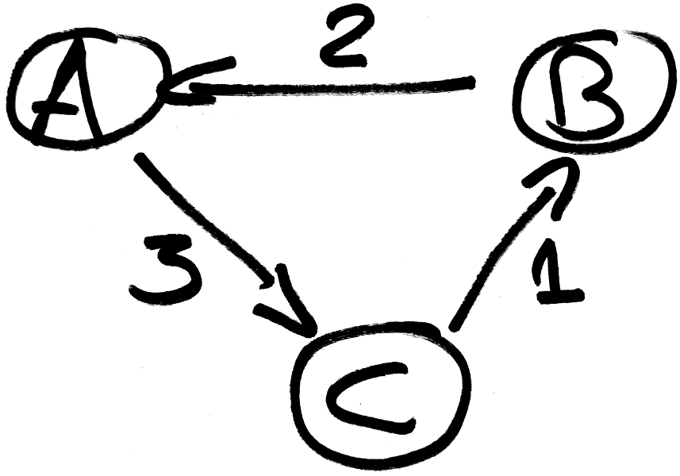

# What are "time tables" ?

Time tables are tables to visualize the passage times of vehicles at the stop points. For example:

|stop  |K2000|De Lorean|Millenium Falcon|
|------|-----|-----|-----|
|London|10:00|11:00|13:00|
| Paris|10:30|11:30|13:37|
|  Roma|11:00|12:00|14:00|

In this example, there are 3 vehicles: K2000, De Lorean and Millenium Falcon. They stop at the stop points London, Paris and Roma.

# Issue

Generating time tables is not a trivial problem. For example, these two time tables represent the same vehicles and they both seem correct:

|stop|  C  |  A  |  B  |
|----|-----|-----|-----|
|  1 |     |01:00|02:00|
|  2 |     |02:00|03:00|
|  3 |     |03:00|04:00|
|  4 |     |05:00|     |
|  5 |     |07:00|     |
|  6 |08:00|09:00|07:00|
|  7 |09:00|10:00|     |
|  8 |10:00|11:00|     |

|stop|  A  |  B  |  C  |
|----|-----|-----|-----|
|  1 |01:00|02:00|     |
|  2 |02:00|03:00|     |
|  3 |03:00|04:00|     |
|  4 |05:00|     |     |
|  5 |07:00|     |     |
|  6 |09:00|07:00|08:00|
|  7 |10:00|     |09:00|
|  8 |11:00|     |10:00|

These two time tables do not have their times sorted at the stop point 6. In fact, on this example, there is no solution with every line sorted.

# Rank voting

Intuitively, we would like the times at a stop point to be sorted as much as possible. Each stop point can rank the vehicles by order of preference. It looks like a rank voting, in which voters rank the candidates by preference. Here, stop points (the voters) vote for the vehicles (the candidates). A stop point preferring a vehicle A to a vehicle B means that it prefers that vehicle A appears before vehicle B.

For our example, the votes are:
 - 1: A > B
 - 2: A > B
 - 3: A > B
 - 4: blank vote
 - 5: blank vote
 - 6: B > C > A
 - 7: C > A
 - 8: C > A

# The Tideman method

There are many types of rank voting. Most of them are Condorcet methods, named for the 18th-century French mathematician and philosopher Marie Jean Antoine Nicolas Caritat, the Marquis de Condorcet.

After studying the different systems, we choose the Tideman method. This method performs well when the voters do not rank all the candidates.

Lets run Tideman on our example. First, pairwise election results are computed:

|   | A | B | C |
|---|---|---|---|
| A |   | 3 | 0 |
| B | 1 |   | 1 |
| C | 3 | 0 |   |

The pairwise election result shows that "3 voters (1, 2 and 3) prefer A to B" and that "1 voter (6) prefers B to A". Then, A is prefered to B with a score of 2. Using this idea, a graph is generated using the differences of the pairwise results:

There is a cycle, thus there is no Condorcet winner. The Tideman method says that we order the edges in descending order, adding them to the graph in this order if it does not introduce a cycle. A topological sort on the created acyclic graph gives the order of the candidate. So:
 - Adding A->C... OK.
 - Adding B->A... OK.
 - Adding C->B... Fail! C->B is not added to the graph.

The topological sort of the created graph is C, A, B. This is our solution, corresponding to the first time table.

# Performances

Let _n_ be the number of vertices, and _e_ be the number of edges. O(_e_) = O(_n_ ²).  The worst case complexity of the straightforward implementation is

  O(_e_ * (_n_ + _e_)) = O(_e_ ²) = O(_n_ ⁴)

In practice, this algorithm is too costly for big time tables.  Let _k_ be the number of edges that will be removed.  O(_k_) = O(_n_ ²).  In practice, it seems that Ω(_k_) = Ω(_n_).  If we use binary searches to find each edges that we need to remove, the complexity is

  O(_k_ * log(_e_) * (_n_ + _e_)) = O(_k_ * _n_ ² * log(_n_ ²)) = O(_k_ * _n_ ² * log(_n_))

Thus, in our case, this algorithm seems to run in

  Ω(_k_ * _n_ ² * log(_n_)) = Ω(_n_ ³ * log(_n_))

which is much better than the naive implementation.  In practice, our problematic case run in 33 seconds using the naive algorithm, and 1 seconds using the binary searches.

For the details and the implementation, you can see [navitia's pull request #1366](https://github.com/hove-io/navitia/pull/1366).

# Stop points' revolution

Thanks to this work, navitia can now propose a great ordering of the vehicles in the time tables. The stop points' revolution is a success: they banished the old tyrannic algorithm and can now live in democracy with a fair voting method!
