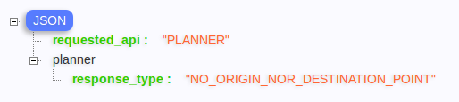
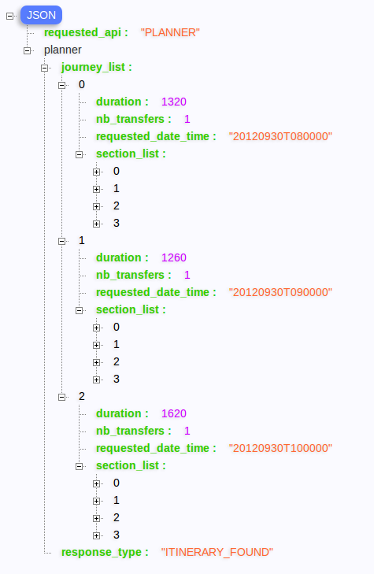
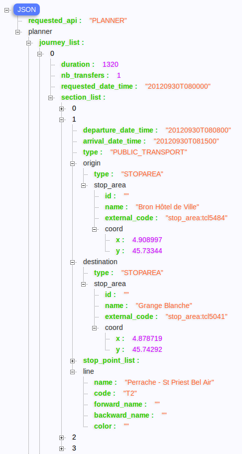
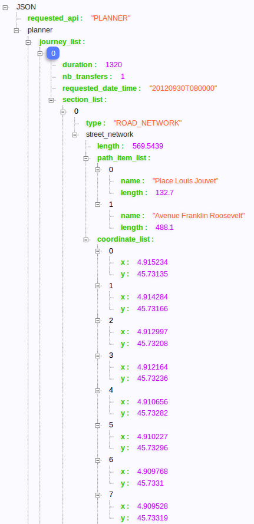
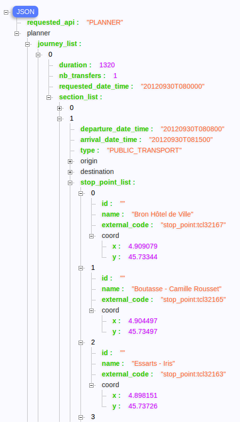

Journeys
========

La fonction Journeys est en charge des calculs d'itinéraires multi-modaux, multi-transporteur.
Cette fonction est exposé sous différentes API de type GET

  * journeys: retourne les différents types d'itinéraires pertinents par rapport à une demande
  * journeysarray: retourne la liste des itinéraires "arrivée au plus tôt" pour une liste d'horaire. Pour chaque horaire, une seule réponse sera fournit, celle-ci pouvant être "pas de solution".

Paramètres d'entrée
*******************

Comme toute les fonctions exposées de NAViTiA, le calcul d'itinéraire accepte des requêtes GET ou POST. 
Il est toutefois conseillé d'utiliser la méthode POST sur ce type de requête, les URI pouvant être assez longue.

Certains paramètres sont partagés pour toutes les API de calcul d'itinéraire. 

Paramètres généraux
-------------------

+-------------+------------------------+-------------------------------------+---------------------------------+
| Paramètre   | Type                   | Remarque                            | Exemple                         |
+=============+========================+=====================================+=================================+
| origin      | Appel par coordonnées: | Coordonnées en WGS84                | &origin=coord:48.8299:2.391     |
|             |    coord:<lon>:<lat>   | Ne pas confondre lat et lon ;-)     |                                 |
|             +------------------------+-------------------------------------+---------------------------------+
|             | Appel par code unique  | URI issue du retour d'un appel      | &origin=stop_area:TCL-0722      |
|             |                        |   à un autre service                |                                 |
|             |                        |   (firstLetter, ptreferential...)   |                                 |
+-------------+------------------------+-------------------------------------+---------------------------------+
| destination | Appel par coordonnées: | Coordonnées en WGS84                | &destination=coord:48.840:2.319 |
|             |    coord:<lon>:<lat>   | Ne pas confondre lat et lon ;-)     |                                 |
|             +------------------------+-------------------------------------+---------------------------------+
|             | Appel par code unique  | URI issue du retour d'un appel      | &destination=stop_area:5555555  |
|             |                        |   à un autre service                |                                 |
|             |                        |   (firstLetter, ptreferential...)   |                                 |
+-------------+------------------------+-------------------------------------+---------------------------------+
| clockwise   | booléen                | &ClockWise=1, on veut partir après  | &clockwise=1                    |
|             |                        |       l'heure indiquée              |                                 |
|             |                        | &ClockWise=0, on veut arriver avant |                                 |
|             |                        |       l'heure indiquée              |                                 |
+-------------+------------------------+-------------------------------------+---------------------------------+

Les paramètres origin et destination peuvent accueillir au choix une URI issue d'une autre API 
(par exemple firstletter ou PTReferential) ou des coordonnées au format WGS84. Ces 2 paramètres sont obligatoires sous une de ces 2 formes.

Paramètres spécifiques à l'API "Journeys"
-----------------------------------------

+-------------+------------------------+-------------------------------------+---------------------------------+
| Paramètre   | Type                   | Remarque                            | Exemple                         |
+=============+========================+=====================================+=================================+
| datetime    | <yyyymmdd>T<hhmi>      | Horaire demandé                     | &datetime=20121007T0715         |
|             |                        | Le fuseau horaire n’est pas géré    |                                 |
+-------------+------------------------+-------------------------------------+---------------------------------+

Exemple d'appel:

http://www.navitia.com/navitia/journeys?format=json&origin=coord:4.915:45.731&destination=coord:4.825:45.760&datetime=20120930T0800&clockwise=1

Paramètres spécifiques à l'API "JourneysArray"
----------------------------------------------

+-------------+------------------------+--------------------------+--------------------------------------------+
| Paramètre   | Type                   | Remarque                 | Exemple                                    |
+=============+========================+==========================+============================================+
| datetime[]  | <yyyymmdd>T<hhmi>      | Liste des horaires       | &datetime[]=20121007T0715&datetime[]=      |
|             |                        |   demandés. Le fuseau    |   20121007T0807&datetime[]=20121007T0853   |
|             | paramètre répété n fois|   horaire n’est pas géré |                                            |
+-------------+------------------------+--------------------------+--------------------------------------------+

Exemple d'appel:

http://www.navitia.com/navitia/journeysarray?format=json&origin=coord:4.915:45.731&destination=coord:4.825:45.760&clockwise=1&datetime[]=20120930T0800&datetime[]=20120930T0900&datetime[]=20120930T1000

Format de sortie
****************

Itinéraire sans solution
------------------------

Les itinéraires sans solutions sont présentés sous la forme suivante:

La liste des types de non réponse est décrite de façon exhaustive dans le fichier navitia.proto

Réponse au service "journeysarray"
----------------------------------

En sortie, NAViTiA fournit une liste d'objet "Journey" contenant chacun un itinéraire présenté intégralement.

Cet itinéraire combine tous les modes couvert par le NAViTiA sous-jacent, c'est à dire, à minima, le mode piéton.

En fonction du mode utilisé pour chaque étape ("section") de l'itinéraire, le détail peut être

  * soit de type "ROAD_NETWORK" ("filaire de voirie", pour les modes piéton, vélos, véhicule personnel...) 
  * soit de type "PUBLIC_TRANSPORT" ("transport en commun" pour les modes bus, train, avion...) 
  * soit de type "TRANSFERT" ("transport en commun" pour les modes bus, train, avion...) 

La réponse repliée est structurée ainsi:

Section de transport en commun dépliée:

Section de marche à pied dépliée:

Liste des points d'arrêts intermédiaires dépliée:

Exemple d'utilisation
*********************

