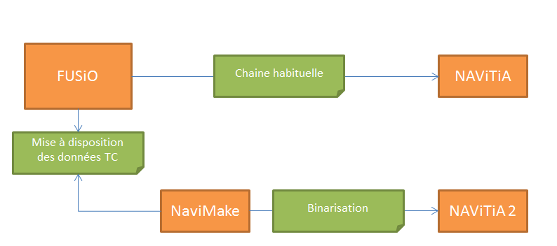
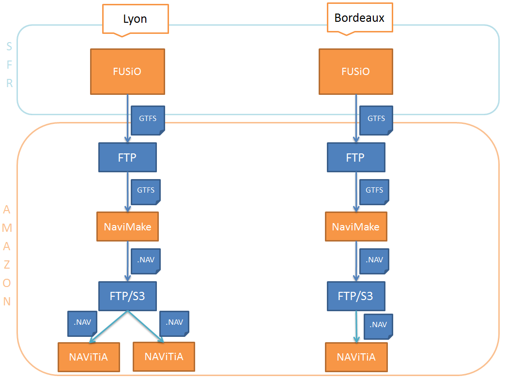

Procédure d'alimentation en données
======================================

La procédure d'alimentation des NAViTiA 2 de chaque "région" vient se greffer de manière transparente sur la chaine déjà en place. Elle peut se décomposer en deux étapes :

* la mise à disposition des données consolidées des différents transporteurs
* la binarisation de ces données

.. todo::
	changer les intitulés des cadres verts et le sens de certaines flèches.

Récupération des données des transporteurs
-------------------------------------------

Lors de la mise en production sur le FUSiO concerné, les données consolidées des contributeurs souhaités sont automatiquement exportées au format GTFS, puis mises à disposition de la suite applicative sur un serveur FTP. 

Il est également possible de déclencher automatiquement l'export et la mise à disposition en utilisant l'API autoimport de FUSiO.

Une version de FUSiO supérieure ou égale à 1.9.64/65.100 (Gaspacho) est nécessaire pour cette partie.

Les tables suivantes sont utilisées :

* config : pour activer ou désactiver l'export sur le site
* contributor_space : pour sélectionner les contributeurs dont les données doivent être exportées
* suitenavitia_servers : pour définir le serveur FTP où déposer les données

Consolidation des données et binarisation
--------------------------------------------

L'applicatif NAViMake récupère les exports GTFS mis à disposition en FTP et se charge d'en fabriquer des .nav

Les fichiers créés sont alors mis à disposition de NAViTiA sur une plateforme Amazon S3.

Récapitulatif du processus
------------------------------

