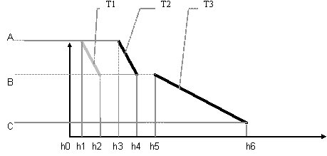
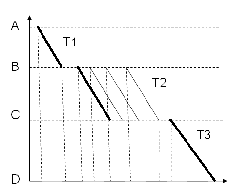
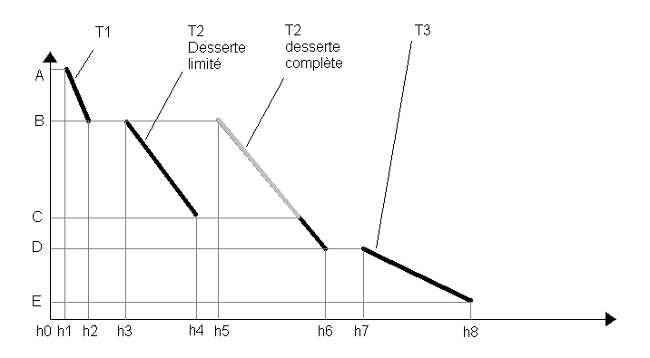
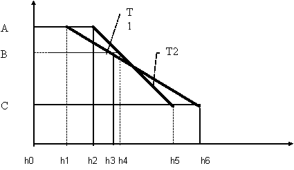
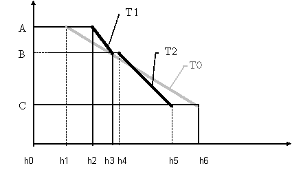
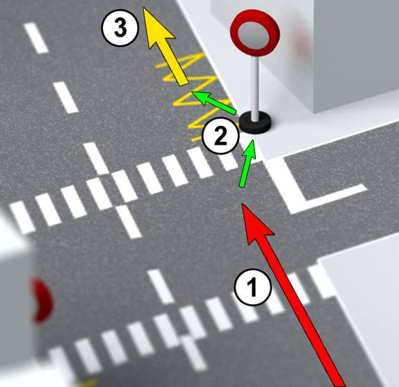
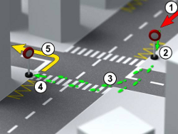
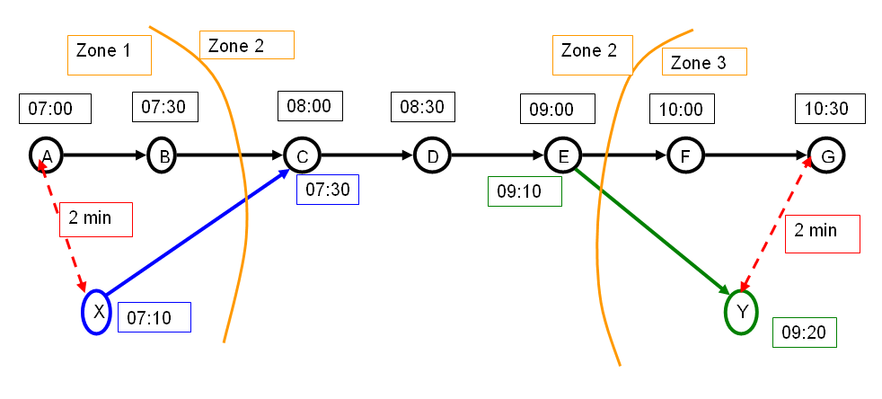
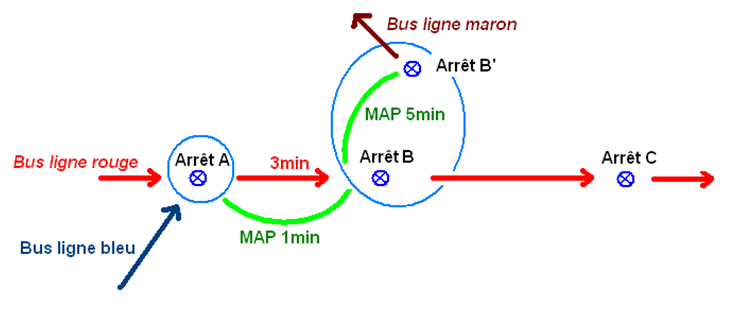

Planner
=======

Introduction
************

Le calculateur d'itinéraire est le composant central de NAViTiA. 
Il est :

* *Multimodal* : prise en compte et combinaison possible de plusieurs modes de transport : transports en commun "classiques"
  (métro, bus, tramway, train), TC ou autres, les modes doux (marche à pied, vélo, Segway !), 
  transports alternatifs (TAD, auto-partage, covoiturage) et véhicules particuliers (VP).
* *Rapide* : Le temps de réponse à une demande est aussi court que possible, afin de permettre une réponse rapide.
* *Robuste* : permettant la gestion d'importants pics de demandes (périodes de rentrées scolaires, perturbations, etc.).
* *Indépendant des médias* : ne se charge pas de l'habillage des réponses obtenues en vue de leur restitution dans un média.
* *Sans état* : chaque appel est dépendant de ses paramètres uniquement. 
  On peut ainsi obtenir une réponse de calcul d'itinéraire en un seul appel 
  (il n'est pas nécessaire de suivre un cheminement précis : obtention des points de départ, d'arrivée, des modes...). 
  Cette gestion permet par exemple à un internaute d'enregistrer son itinéraire favori et d'obtenir son prochain départ en 1 clic.
* *Capable de tirer parti du temps réel* : affichage des perturbations dans les fonctions de calcul d'itinéraire multimodal 
  et de tableau des prochains départs, et calcule des itinéraires de contournement pour éviter l'ensemble des perturbations.
  NAViTiA détermine le meilleur trajet possible compte tenu des paramètres suivants (liste non exhaustive) 

NAViTiA calcule le meilleur trajet possible compte tenu des données présentés dans les chapitres suivants, et selon les critères de calcul et l'algorithme demandé.

Points de départ et de destination
**********************************

Le calculateur permet un rabattement automatique depuis des coordonnées géographiques vers un ensemble de points du réseau de transport.
L'algorithme détermine intrinsèquement les meilleurs points à utiliser parmi la liste des points fournit et pour un itinéraire donnée. 
il convient de remarquer que le meilleur point de départ n'est pas forcément le plus proche en transport en commun.

Départ depuis un nuage de point d'arrêt
---------------------------------------

Plusieurs points de départ possibles 

* Avec un horaire associé à chacun de ces points d'arrêt si sens=1
* Attention au départ depuis une commune, à gérer en amont du moteur pour le choix des arrêts

Arrivée à un nuage de point d'arrêt
-----------------------------------
Plusieurs points de destination possibles

* Avec un horaire associé à chacun de ces points d'arrêt si sens=-1
* Attention à la destination vers une commune, à gérer en amont du moteur pour le choix des arrêts

Horaires
********

Calendriers de circulation 
--------------------------
La gestion des calendriers est indispensable

  * elle permet de n'utiliser que les circulations effectivement actives à la date demandée
  * elle permet de fournir exactement les circulations à emprunter lors de la gestion des itinéraires passe-minuit

Typologie des horaires
----------------------

* Prise en compte de l'ensemble des horaires définis dans la base de données, dans un ordre temporel logique. 
  Pas d'approximation fréquence par exemple
* Ainsi toutes les structures de lignes possibles sont gérée:

  * à antennes, 
  * à tiroir, 
  * en boucle, 
  * omnibus/direct
  * avec retour sur itinéraire...
  * dès lors que la suite d'horaire de chacune des circulations est définie 
    dans un ordre temporel cohérent sur la course (sans "retour dans le temps")

* Horaires distincts au départ/à l'arrivée

  * Sur chaque horaire, l'heure d'arrivée et l'heure de départ peuvent être différentes
    Par exemple, c'est le cas typique des trains qui attendent plusieurs minutes en gare. 
    Il est nécessaire d'indiquer l'heure d'arrivée aux voyageurs qui descendent et l'heure de départ aux voyageurs qui montent à cette gare.
  * Ces horaires sont utilisés à chaque correspondance (descente, correspondance, montée)

Passe-minuit
------------

À préciser: gestion des points suivants:

* Circulation passe-minuit
* Arrêt passe-minuit (arrivée en gare à 23h59, départ à 00h01 le lendemain)
* Correspondance avec une circulation du lendemain
* Correspondance le lendemain avec une circulation partie la veille
* La gestion des calendriers doit suivre le passe-minuit (calendrier de circulation sur l'horaire)

Sens de la recherche
--------------------

* 1 pour **partir après**

        La demande se fait avec un départ après l'heure demandée. 
        Cette demande est typique d'une recherche sur le prochain départ d'un itinéraire.
 
        *Exemple : prochain départ pour le retour du client à son domicile.*

* -1 pour **arrivée avant**

        La demande se fait avec une arrivée avant l'heure demandée. 
        Cette demande est typique d'une recherche d'itinéraire anticipée.

        *Exemple : le client cherche à arriver avant 9h à son travail.*

Algorithmes de recherche
************************

Calcul "Arrivée au plus tôt"
----------------------------

Il propose l'itinéraire qui permet d'arriver au plus tôt à destination.

* Dans le cas où plusieurs solutions sont possibles pour la même heure d'arrivée

  * On choisit la solution qui utilise le moins de correspondances
  * Si plusieurs solutions utilisent le même nombre de correspondances

    * On choisit la solution qui utilise le moins de marche à pied
    * Si plusieurs solutions utilisent le moins de temps de marche à pied

      * On choisit la solution qui maximise les temps de correspondance
        afin d'assurer les correspondances au mieux

* Cet itinéraire servira de **référence** lors de la validation de la pertinence
  des itinéraires sur les critères de calcul "Moins de correspondance" et
  "Moins de marche à pied"

Calcul "Moins de correspondance"
--------------------------------
                  
Il propose l'itinéraire qui minimise le nombre de correspondance pour une recherche donnée (O/D, date, heure de départ ou d'arrivée).

* Dans le cas où plusieurs solutions sont possibles en utilisant le même nombre de correspondance

  * On choisit la solution qui arrive le plus rapidement
  * Si plusieurs solutions arrivent à la même heure

    * On choisit la solution qui utilise le moins de marche à pied
    * Si plusieurs solutions utilisent le même temps de marche à pied

      * On choisit la solution qui maximise les temps de correspondance
        afin d'assurer les correspondances au mieux

* Filtré si la réponse ne respecte pas les règles de présentation par rapport au 
  critère "Arrivée au plus tôt"

  * 30=1x+15 > si Tcritère 1 < 30 minutes, alors Tcritère 2 < Tcritère 1 + 15
  * 60=1x+30 > si Tcritère 1 < 60 minutes, alors Tcritère 2 < Tcritère 1 + 30
  * @=1.5x+0 > sinon Tcritère 2 < 1,5 x Tcritère 1

Calcul "Moins de marche à pied"
-------------------------------

Il propose l'itinéraire qui minimise le temps de marche à pied, (pas nécessairement le nombre de marche à pied dans une solution) 
pour une recherche donnée (O/D, date, heure de départ ou d'arrivée).

* Dans le cas où plusieurs solutions sont possibles en utilisant les mêmes temps de marche à pied

  * On choisit la solution qui arrive le plus rapidement
  * Si plusieurs solutions arrivent à la même heure

    * On choisit la solution qui utilise le moins de correspondances
    * Si plusieurs solutions utilisent le même nombre de correspondance minimal

      * On choisit la solution qui maximise les temps de correspondances
        afin d'assurer les correspondances au mieux

* Filtré si la réponse ne respecte pas les règles de présentation par rapport au 
  critère "Arrivée au plus tôt"

  * 30=1x+15 > si Tcritère 1 < 30 minutes, alors Tcritère 2 < Tcritère 1 + 15
  * 60=1x+30 > si Tcritère 1 < 60 minutes, alors Tcritère 2 < Tcritère 1 + 30
  * @=1.5x+0 > sinon Tcritère 2 < 1,5 x Tcritère 1

**Remarque : Humanisation du critère "moins de marche à pied"**

Le critère "moins de marche à pied" ne peut pas être présenté sans ajouter une certaine souplesse dans le résultat. 
En effet, cet itinéraire est souvent possible sans aucune marche à pied, 
en faisant du saut de bus en bus et en multipliant ainsi le nombre de correspondance.

Il existe donc un paramètre NumMinuteByInterchange au moteur de calcul d'itinéraire NAViTiA. 
Ce paramètre agit ainsi :

* NAViTiA observe tous les trajets possibles pour calculer un itinéraire

  * le paramètre NumMinuteByInterchange agit pendant le calcul d'un de ces trajets.
  * Il agit donc au moment où l'on observe une correspondance sur un des trajets résolvant l'itinéraire
  * Il permet de n'utiliser une correspondance supplémentaire que si elle permet d'optimiser au moins NumMinuteByInterchange de trajet à pied.

* Lorsque NAViTiA teste si elle peut emprunter une circulation (bus ou tramway par exemple) pour résoudre le trajet, elle teste donc

  * que l'on peut monter dans le véhicule (les horaires sont compatibles)
  * que pour chaque arrêt desservi de ce véhicule

    * on optimise le temps de marche à pied par rapport à d'autres trajets qui ont permis de rejoindre cet arrêt
    * cette optimisation tient compte d'un paramètre NumMinuteByInterchange 

* Conséquence : les itinéraires finaux proposés peuvent sembler ne pas tenir compte de ce critère

  * ci-dessous il n'y a qu'une minute de différences de marche à pied entre les 2 itinéraires, pour NumMinuteByInterchange=3
  * Cependant l'itinéraire est de type "commune à commune" et les 2 trajets sont sur des parcours très différents 
    (les arrêts de destination sont très éloignés dans cet exemple)

.. image:: ../_static/NumMinuteByInterchange.png

Optimisations des résultats
***************************

Minimisation du temps d'attente
-------------------------------

**Cas simple** : optimisation du temps de trajet

L'algorithme permet d'obtenir l'arrivée au plus tôt. 
Ci-dessous, le trajet de A à C utilise le train T1 suivi du train T3 pour un départ demandé à h0.

.. image:: ../_static/MinimisationTempsAttenteA.png

Ce trajet, s'il est cohérent peut cependant être amélioré par l'utilisation du train T2 en place du train T1 :

En effet sur ce deuxième trajet, le voyageur :

* part plus tard (il part en h3 > h1),
* attend moins longtemps sa correspondance en B,
* et arrive à la même heure. 

L'algorithme proposera donc cette deuxième solution, dans laquelle le temps d'attente des voyageurs est optimal.

**Cas composé** : optimisation du temps d'attente sur les correspondances

Dans le cas suivant, tous les trajets possibles offrent la même durée totale de trajet. 
Toutefois, l'algorithme proposera au voyageur d'utiliser la première circulation T2 pour attendre C. 

Ce cas est commun lors d'un trajet interurbain via une commune multi-gare. 
Ainsi pour un trajet de Caen vers Reims, par exemple, il est nécessaire :

* De commencer par emprunter un train Caen vers Paris St Lazare de faible fréquence quotidienne.
* Puis utiliser le métro dans Paris en *offre quotidienne très fréquente*.
* Et finir le trajet par un train Paris gare de l'Est vers Reims de faible fréquence quotidienne.

L'algorithme proposera bien la solution usuelle dessinée en gras.
Ce type de trajet peut être généralisé à tout trajet qui mixe faible et forte fréquence d'offre transport.

Minimisation du nombre de correspondance
----------------------------------------

L'itinéraire en noir ci-dessous est correct algorithmiquement. 
Cependant, l'itinéraire le plus pertinent pour le client utilise la circulation T2 complète 
afin de limiter le nombre de correspondances (pour des mêmes heures de départ et d'arrivée).

L'algorithme optimise donc le nombre de correspondance, même sur des itinéraires 
à durée de trajet global et à heure de départ et heure d'arrivée égaux.

Gestion des sous-chemin non optimaux
------------------------------------

Ce cas intervient lorsqu'une ligne comporte à la fois des circulations directes 
et des circulations omnibus : 
le train direct peut alors parfois doubler l'omnibus:

Dans le cas suivant d'un trajet avec correspondance(s) 
et pour une recherche de l'itinéraire "le plus rapide", 
L'algorithme proposera l'itinéraire T1+T2 :

Dans le cas d'une recherche de l'itinéraire avec le "moins de correspondance", 
L'algorithme proposera bien sûr le train T0 (voir schéma ci-dessus).

Gestion des correspondances
***************************

NAViTiA exploite 2 types de correspondances :

* La correspondance intra-point d'arrêt : on passe d'un véhicule à un autre, 
  sans changer de point d'arrêt.
* La correspondance inter-zone d'arrêt : il est nécessaire de marcher pour 
  changer de point d'arrêt. Ce type de correspondance peut être découpé:

  * La correspondance intra-zone d'arrêt : on change de point d'arrêt sans changer 
    de zone d'arrêt (par exemple : on traverse la rue). 
  * La correspondance inter-zone d'arrêt : on change à la fois de point d'arrêt 
    et de zone d'arrêt (par exemple pour aller de l'arrêt "gare Papin" à Angers 
    à la "gare Marengo"). 
    Ce type de correspondance correspond par exemple, dans OBiTi,
    à la notion de "ligne à pied", permettant de relier 2 zones d'arrêts distinctes.

De façon implicite (c'est-à-dire sans qu'aucune donnée spécifique n'ait été injectée), NAViTiA permet les correspondances suivantes :

* Correspondance intra point d'arrêt.
* Eventuellement correspondance intra-zone d'arrêt (correspondance 
  entre 2 points d'arrêt, au sein d'une même zone d'arrêt) 
  en utilisant un temps de correspondance calculé à la binarisation
  selon les coordonnées géographique.

En revanche, pour qu'une correspondance inter-zones d'arrêt soit proposée par NAViTiA, 
elle doit avoir été préalablement déclarée dans les données.

Gestion des temps de correspondance intra-point d'arrêt
-------------------------------------------------------

Pour chaque point d'arrêt, on peut spécifier la durée de correspondance 
à utiliser par le moteur. 

**Remarque: gestion des temps d'attente**
 
Il est possible de spécifier un temps de correspondance différent 
pour chaque point d'arrêt (il ne s'agit pas d'un paramètre global).
Cette durée correspond à la notion de "tolérance d'exécution" 
par rapport à l'heure théorique prévue. 

Une durée de 0 minute peut se justifier dans des conditions bien précises, 
par exemple dans le cas d'une correspondance garantie sur un pôle 
où tous les mobiles s'attendent avant de partir.

Attention, spécifier une durée de 0 minute sans justification particulière 
peut entraîner des réponses incohérentes de la part du moteur de calcul. 
La correspondance n'étant pas pénalisée, le système pourra proposer 
des correspondances non réalisables (phénomène du "saute-mouton de bus en bus")

Gestion des temps de correspondance inter-point d'arrêt
-------------------------------------------------------

Une correspondance inter-point d'arrêt se décompose en deux temps :

* Le temps de la correspondance inter-point d'arrêt 
  qui correspond au temps nécessaire pour passer d'un point d'arrêt 
  donné à un autre point d'arrêt. 
  Il s'agit du temps "d'exécution de la correspondance".
 
  **Remarque** : seul ce temps est comptabilisé dans le temps de marche à pied.

* Le temps de la correspondance intra-point d'arrêt 
  qui correspond à la "tolérance d'exécution" décrite au chapitre précédent. 
  Il est identique au temps de correspondance intra-point d'arrêt 
  de l'arrêt de montée (arrêt de destination de la correspondance).

Dans le flux XML de réponse de NAViTiA, les 2 notions présentées 
ci-dessus correspondent respectivement à :

* **LinkConnection**: exécution de la correspondance 
  pour passer d'un point d'arrêt à l'autre.
* **StopPointConnection**: tolérance d'exécution de l'offre 
  sur l'arrêt de montée de la correspondance).

Le principe est d'effectuer d'abord la correspondance à proprement parler 
*LinkConnection* puis le temps d'attente éventuel *StopPointConnection*.

**Remarque: gestion de la marche à pied**

  * Il est possible de spécifier un temps de correspondance différent 
    pour chaque couple "point d'arrêt origine" vers "point d'arrêt destination":
    il ne s'agit pas d'un paramètre global.
  * Prise en compte de la vitesse de marche à pied afin de faire varier 
    la durée de la liaison *LinkConnection* uniquement.
  * Prise en compte de l'accessibilité de la correspondance (gestion UFR) 
    en utilisant les mêmes propriétés que celles définies
    pour l'accessibilité des points d'arrêts

Résumé sur les correspondances
------------------------------

Il est possible de définir des temps de correspondances distincts 
de A vers B et de B vers A. Ce qui n'est pas si simple sur 
une demande du type "arriver avant" ;-)

Soient 2 arrêts physiques distincts (A' et A'') appartenant 
tous deux à une même zone d'arrêt. 
On peut donc spécifier les durées de correspondances suivantes 

+---------------+----------------------+--------+--------------------------------------+
|Correspondance | Type                 | Durée  | Commentaire                          |
+===============+======================+========+======================================+
|A'             |Intra point d'arrêt   |        |Dans les données, cette information   |
|               |(StopPointConnection) | 2 min. |peut par exemple être spécifiée comme | 
|               |                      |        |une correspondance entre A' et A'     |
|               |                      |        |(correspondance vers lui-même)        |
+---------------+----------------------+--------+--------------------------------------+
|A''            |Intra point d'arrêt   |        |Correspondance garantie               |
|               |(StopPointConnection) | 0 min. |                                      |
+---------------+----------------------+--------+--------------------------------------+
|A' > A''       |Intra zone d'arrêt    |        |                                      | 
|               |(LinkConnection)      | 3 min. |                                      |
+---------------+----------------------+--------+--------------------------------------+
|A'' > A'       |Intra zone d'arrêt    |        |Escalator pour                        |
|               |(LinkConnection)      | 2 min. |accélérer la correspondance           |
+---------------+----------------------+--------+--------------------------------------+

* Lors d'une correspondance en A' (pas de changement de point d'arrêt), 
  le système ne proposera que les correspondances supérieures ou égales 
  à 2 minutes (0 minute pour une correspondance en A'').
* Lors d'une correspondance de A' vers A'', le système ne proposera 
  que des correspondances supérieures ou égales à
  3 minutes (*LinkConnection*) + 0 minute (*StopPointConnection* en A'').
* Lors d'une correspondance de A'' vers A', le système ne proposera 
  que des correspondances supérieures ou égales à 
  2 minutes (*LinkConnection*) + 2 minutes (StopPointConnection en A').

On a donc, en fonction des cas :

* Pour une correspondance "Intra point d'arrêt" : 
  le point de départ et le point d'arrivée sont identiques. 
  La durée de correspondance correspond à son temps d'exécution qui :

  * n'est pas impacté par la vitesse de marche à pied choisie comme paramètre
    de la recherche d'itinéraire,
  * n'est pas comptabilisé dans le temps de marche à pied de la solution trouvée.

On peut considérer que ce temps correspond à une "tolérance d'exécution" 
de l'offre : Il peut être défini à 0 si et seulement si la correspondance 
est "garantie" (par exemple si 2 véhicules "s'attendent" sur ce point d'arrêt).

* Pour une correspondance "Inter point d'arrêt" : le point de départ et
  le point d'arrivée sont différents. 
  La durée de correspondance indique le temps nécessaire pour relier ces deux points. 
  Il sera :

  * *Impacté* par la vitesse de marche à pied choisie comme paramètre 
    de la recherche d'itinéraire.
  * *Comptabilisé* comme temps de marche à pied (différent du temps 
    de correspondance).

Le mode de gestion des correspondances peut également prendre en compte 
des temps de correspondances distincts en fonction des lignes 
desservant les points d'arrêts.

Gestion des arrêts préférentiels de correspondance
--------------------------------------------------

Entre 2 itinéraires présentant des caractéristiques identiques 
(temps de trajet, heure de départ/d'arrivée, nombre de correspondances, 
temps de marche à pied) NAViTiA préfèrera l'itinéraire utilisant 
le plus de zones d'arrêts dont la propriété 
"arrêt préférentiel pour les correspondances" (MainConnection) est vraie.

Ainsi si plusieurs possibilité de correspondances entre 2 lignes 
sur un itinéraire (tronc commun) alors

* On propose en priorité l'arrêt noté "préféré pour les correspondances"
* Sinon, on propose la correspondance qui nécessite le moins de mche à pied
* Sinon, on propose la correspondance qui offre le plus de temps d'attente afin d'assurer un maximum
  l'itinéraire

.. image:: ../_static/ArretPrefCorr.png

Durée minimum de correspondance
-------------------------------

Définie par StopPoint. A faire évoluer si possible vers une durée minimum en fonction de l'heure:
*correspondances assurées le matin à 07h30 et le soir à 17h30*

Durée maximum de correspondance
-------------------------------

Permet d'éliminer les itinéraires faisant attendre 5h en gare 
entre le dernier train du soir et le premier train du lendemain 
sur un itinéraire passe-minuit.

La problématique est prise en compte sur le calcul retour de l'algorithme
(optimisation ddu temps de trajet). En effet il n'est pas possible 
de faire le test tant que le calcul retour n'a pas optimisé l'heure de départ du calcul aller.

* Si on fait le test en sens aller (arrivée au plus tôt)

+----------+-----------+----------------+
|Arrêt     |Heure      |Durée de corresp|
+==========+===========+================+
|A départ  |07h00      |                |
+----------+-----------+----------------+
|B arrivée |09h00      |                |
+----------+-----------+----------------+
|  Corresp |           |   6 heures     |
+----------+-----------+----------------+
|B départ  |15h00      |                |
+----------+-----------+----------------+
|C arrivée |17h00      |                |
+----------+-----------+----------------+

* on élimine ce trajet, alors que avec un calcul en sens retour

+----------+-----------+----------------+
|Arrêt     |Heure      |Durée de corresp|
+==========+===========+================+
|A départ  |12h00      |                |
+----------+-----------+----------------+
|B arrivée |14h00      |                |
+----------+-----------+----------------+
|  Corresp |           |   1 heure      |
+----------+-----------+----------------+
|B départ  |15h00      |                |
+----------+-----------+----------------+
|C arrivée |17h00      |                |
+----------+-----------+----------------+

L'itinéraire est correct.

Gestion des montées/descentes interdites
****************************************

Interdiction de Trafic Local (ITL)
----------------------------------

Les différents algorithmes gèrent de façon intrinsèque les interdictions de trafic local (ITL). 
Ils utilisent les informations d'ITL de façon conjoncturelle au cours de la recherche afin de proposer la meilleure solution.
En effet, le voyageur peut ou ne peut pas descendre à un arrêt en fonction de l'arrêt où il est monté.
Les ITL sont configurables par circulation.

L'exemple ci-dessous présente une ITL pour la ligne noire sur la zone 2 : 
l'utilisateur ne peut descendre à un des arrêts de cette zone que s'il est monté dans le véhicule à un arrêt situé dans une zone différente. 
Par exemple un trajet entre A et G ci-dessous :

Le trajet le plus rapide consiste à 

* rejoindre X à pied en début de trajet, 
* correspondance en C, 
* correspondance en E, 
* puis descente en Y 
* et rejoindre à pied G

cependant la *descente est interdite en E si l'on vient de C et D*.
Le trajet proposé sera donc A vers E puis correspondance en E vers Y puis marche à pied vers G.

Montée/descentes interdites
---------------------------

Certains horaires ne sont accessibles qu'en montée ou en descente, quelque soit la conjoncture.

*Exemple le plus typique: l'horaire terminus n'a pas d'heure de départ*
 
Itinéraire et accessibilité 
**************************

Gestion des propriétés d’accessibilité sur les objets de transport
------------------------------------------------------------------

Les propriétés d’accessibilité sont appliquées directement sur les objets mis en œuvre.
Ainsi, chaque véhicule utilisé porte les critères d’accessibilité qui lui sont propre (possibilité d'embarquer un vélo, accès facilité aux fauteuils roulant...).

* Liste des critères d’accessibilité des véhicules

  * Accès UFR (MIPAccess)
  * Embarquement vélo (BikeAccepted)
  * Air conditionné (AirConditioned)
  * Annonces visuelles adaptées aux malentendants (VisualAnnouncement)
  * Annonces sonores adaptées aux malvoyants (AudibleAnnouncement)
  * Accompagnement à bord (AppropriateEscort)
  * Signalisation adaptée déficience cognitive (AppropriateSignage)
  * Bus scolaire (SchoolVehicle)

* Liste des critères d’accessibilité des points d’arrêt

  * Point d’arrêt abrité (Sheltered)
  * Accès UFR (MIPAccess)
  * Accès complet par escalier mécanique (Elevator)
  * Accès complet par ascenseur (Escalator)
  * Embarquement vélo (BikeAccepted)
  * Parking vélo (BikeDepot)
  * Annonces visuelles adaptées aux malentendants (VisualAnnouncement)
  * Annonces sonores adaptées aux malvoyants (AudibleAnnouncement)
  * Accompagnement à bord (AppropriateEscort)
  * Signalisation adaptée déficience cognitive (AppropriateSignage)

Exemple d’utilisation sur le cas de l’accessibilité UFR
-------------------------------------------------------

NAViTiA traite les critères d’accessibilité Utilisateur de Fauteuil Roulant (UFR) comme une combinaison de plusieurs critères binaires :

* Accessibilité UFR des points d’arrêt (une station de métro doit proposer un ascenseur par exemple).
* Accessibilité du mobile (les rames de métro doivent avoir un espace prévu pour les UFR).
* Accessibilité des correspondances

Il est également possible :

* De faire varier la vitesse de marche à pied pour l’ensemble du calcul d’itinéraire.
* D’utiliser les critères binaires pour définir différents types de Personnes à Mobilité Réduite (PMR).

Inégalitées triangulaire
************************

NAViTiA gère de façon intrinsèque la succession de plusieurs correspondances. 
A partir de :

* Une correspondance entre 2 arrêt A et B de durée T1.
* Une correspondance entre 2 arrêts B et C de durée T2.

NAViTiA peut proposer une correspondance entre A et C 
si elle est pertinente pour la recherche. 
Si cette correspondance n'a pas été définie dans les données, 
NAViTiA applique la somme des durées de correspondance entre A et B et B et C : 
T3= T1 + T2. 
Ce fonctionnement est automatique et géré à la binarisation.

Cette gestion permet également de contourner l'anomalie suivante:

* Dans le bus, on arriva en A à Ta, la MAP vers B met à jour B à Tbmap.
* Arrivé en B à Tb, on a Tb > à Tbmap

  * En effet la MAP se fait en 1' quand le bus met 3'
  * Conséquence: on ne met pas non plus à jour la correspondance vers B'
  * On perd une correspondance interessante.

Prolongement de service
***********************

La notion de "prolongement de service", lorsqu'elle est disponible, 
permet d'affiner l'information au client. 
Un prolongement de service a lieu lorsqu'un bus enchaine deux missions. 
Le cas le plus fréquent consiste à enchainer les parcours aller et retour, 
mais il est possible d'enchaîner sur un parcours d'une autre ligne

.. image:: ../_static/ProlongementService.png

L'arrêt bleu est un arrêt terminus. L'arrêt A n'est desservi que dans un sens.
Pour un trajet de A vers B, NAViTiA est capable d'indiquer sur l'arrêt bleu : 
"le bus change de direction, restez dans le véhicule"

.. warning::
  Lorsque cette information lui est fournie, le moteur de calcul est capable 
  de "forcer" la correspondance sans temps d'attente minimal 
  sur l'arrêt bleu du schéma ci-dessus

**Implémentation**
Tous les StopPoint desservis par le VehicleJourney prolongé
(appelé NextVehicleJourney) sont mis à jour avec PrecVehicleJourney= VehicleJourney

Itinéraires contraints
**********************

Itinéraires "via une zone"
--------------------------

Il est possible de forcer le moteur de calcul à faire une correspondance sur une collection de point d'arrêt.
L'itinéraire proposé passera alors par un des points demandés. 

Ce paramètre est unique, il n'est pas possible de forcer le trajet à passer par plusieurs zones géographiques.

Désactivation d'objet
---------------------

Il est possible de désactiver l'utilisation de certains objets dans l'algorithme afin de ne pas les proposer dans les solutions.
L'exemple le plus simple est le choix des modes pour le voyageur (pas d'utilisation des bus dans Paris par exemple)

PLusieurs types d'objets peuvent être désactivés simultanéments. Les différents types d'objets désactivables sont les suivants:

* Désactivation de *n* modes
* Désactivation de *n* réseaux
* Désactivation de *n* groupes de lignes
* Désactivation de *n* ligne 
* Désactivation de *n* parcours
* Désactivation de *n* circulation
* Désactivation de *n* zone d'arrêt
* Désactivation de *n* point d'arrêt

La gestion des bus scolaire est particulière. En effet, il est possible de lancer un calcul d'itinéraire qui:

* Tient compte de l'ensemble des véhicules (scolaire ou non scolaire)
* Ne tient compte que des véhicules non scolaires
* Ne tient compte que des véhicules scolaires (pour forcer une recherche d'itinéraire avec une "carte scolaire" par exemple)

Limitations de recherche
------------------------

Limitation du nombre de correspondance
~~~~~~~~~~~~~~~~~~~~~~~~~~~~~~~~~~~~~~

Il est possible de limiter l'algorithme aux itinéraires en *n* correspondances.
Ainsi:

* si n=0: force la recherche de trajet en direct
* si n=1 ne proposera pas de trajet en plus d'1 correspondance, même si certains itinéraires en 2 correspondances sont nettement plus rapide
* ...

Limitation du temps de trajet
~~~~~~~~~~~~~~~~~~~~~~~~~~~~~
Il est possible de limiter l'algorithme sur une durée de trajet maximale
Ainsi:

* si MaxDuration=1200: force la recherche de trajet en moins d'une heure (1200 secondes)

Lignes TAD (transport à la demande ou transport flexible)
*********************************************************

