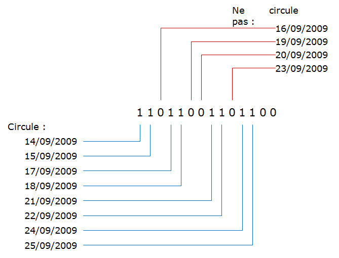

VPtranslate
============

Ce module permet de traduire une suite de date exhaustive (régime de circulation) en phrase intelligible:

* Transforme "Circule le 06/04,13/04,20/04,27/04"
* En "circule les lundi du 06/04/ au 03/05"

Cette fonction peut être utilisable par exemple conjointement avec les services suivants :

* Recherche des propriétés d’une desserte : 
  en plus des propriétés d’arrêt et d’horaire desservis, de véhicule utilisé, 
  la consultation de desserte retourne la condition de service. Il est alors possible 
  d’appeler l’API de traduction de régime pour signifier de façon intelligible les jours de circulation.
* En calcul multimodal : 
  NAViTiA calcule la chaîne binaire de condition de circulation globale 
  à chaque itinéraire proposé en faisant l’intersection des conditions de service utilisées. 
  Il est donc possible d’appeler ensuite cette fonction afin de fournir au client une réponse 
  multimodale sur l’information de circulation : itinéraire circulant du lundi au vendredi sauf mercredi, du... au...

**Exemple**

* Si "Date=14/09/2009", et que "Pattern=11011001101100"
* Alors la demande porte sur : traduire la liste des jours actifs suivant :

  * 14/09/2009
  * 15/09/2009
  * 17/09/2009
  * 18/09/2009
  * 21/09/2009
  * 22/09/2009
  * 24/09/2009
  * 25/09/2009

* En effet :

* La réponse NAViTiA sera du type "circule du Lundi au vendredi, sauf mercredi, du 14/09/2009 au 25/09/2009"

Paramètres d'entrée
********************************
à partir des paramètres suivants :

* La date de début de circulation : circule à partir du …
* Une chaîne de 0 et 1 représentant la condition de circulation : 1111100111110011111001111100

Spécifications fonctionnelles du service
****************************************

Principe global
---------------

Dans la chaîne représentant la condition de circulation ("111100111100111100") 

* NAViTiA recherche les motifs les plus représentatifs (chaque motif est composé de 7 jours).
* Pour chaque motif (du plus représenté au moins représenté) :

  * le motif est associé à n plages de date « du… au … »,
  * et à un libellé associé au motif. Par exemple : 1111100 -> libellé "circule du lundi au vendredi".

Quelque soit le paramétrage, la réponse du traducteur de régime sera juste, mais pas forcément optimale selon des critères subjectifs.

Les paramétrages (voir ci-dessous) permettent de corriger certaines réponses. 
L’intégration dans le média permet également de présenter au mieux la réponse par rapport au client visé.

Algorithme détaillé
-------------------

On construit de façon automatique ou manuelle les cibles de référence. Une cible représente l'association d'un motif et d'un libellé. Par exemple : 1111100 -> libellé "circule du lundi au vendredi". Il y a au total 128 cibles.

On teste en premier s'il y au moins un jour actif dans la condition de circulation
si faux -> on renvoie "ne circule pas"

sinon
  Mise à l’écart des jours précédent le premier lundi et des jours suivant le dernier dimanche 
  traitement ultérieur avec les premiers jours libres

  Découpage de la condition de service (CS) en semaine

  .. image:: ../_static/decoupage_cs.png

  Pour chaque cible, on compte le nombre de semaine ainsi que la première et la   dernière (suivant l'ordre calendaire) qui lui corresponde. Cela permet de déterminer les périodes d'application de la cible. Si pour une cible, une seule semaine est identifiée on va la fusionner avec le motif le plus approchant (détermination par un algorithme de distance) et calculer les exception associées.

  Si le résultat de cette première phase d'exploration n'est pas satisfaisante en terme de quantité de motifs et / ou périodes d'applications on va essayer de fusionner les cibles en gérant conjointement les exceptions.

  Pour finir on va fusionner les extrémités de la condition de circulation qui ont été écartées au début au résultat précédemment obtenu.

Paramétrages de la fonction
---------------------------

Les paramétrages permettent d’influer sur la réponse. Ainsi pour une demande du type :

* Date de début : lundi 01/06/2009.
* Chaîne de régime : "1101100".
* 2 résultats pourront être proposés :

  * Soit :
    Du lundi au vendredi du 01/06/2009 au 05/06/2009, sauf le mercredi 03/06/2009.
  * Soit :
    Du lundi au vendredi sauf mercredi du 01/06/2009 au 05/06/2009.
  * Soit :
    Les lundi, mardi, jeudi et vendredi du 01/06/2009 au 05/06/2009.
  * Selon les paramétrages de présentation mis en place.

Il n’est possible de paramétrer qu’une seule liste de dates pour les jours fériés, basée sur les jours fériés français. 
Pour les autres pays, il est nécessaire de modifier le fichier de paramétrage et 
de désactiver la génération automatique des jours fériés. 
La fonction de calcul automatique des jours fériés retourne :

* Le 1er janvier
* Le 1er mai
* Le 8 mai
* Le 14 juillet
* Le 15 août
* Le 1er novembre
* Le 11 novembre
* Le 25 décembre
* Le lundi de pâques
* Le jeudi de l’ascension
* Le lundi de pentecôte

Module utilisé
--------------

Fonctions internes
------------------

Format de sortie
****************

Exemple d'utilisation et module de démonstration
************************************************

Tests unitaires
***************
