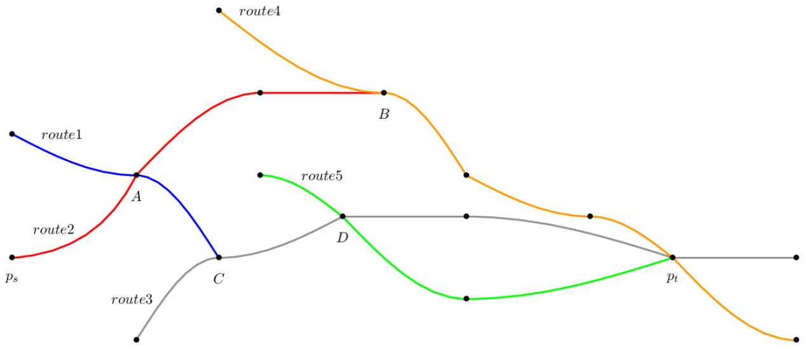

RAPTOR
######
RAPTOR est un algorithme proposé par Delling dans http://siam.omnibooksonline.com/2012ALENEX/data/papers/024.pdf .Il présente des performances intérressantes, et mérite donc d'être implémenté et étudier. 
Nous allons voir son principe de base, et ses différentes variantes.

Principe de base 
-----------------
RAPTOR fonctionne par tour, à chaque tour k de l'algorithme on sait comment aller arriver au plus tôt en k-1 correspondances à tous les arrêts(certains arrêts ne seront pas atteignables).
On retient ce temps d'arrivée dans une étiquette, qui retient pour chaque arrêt et pour chaque tour quel est le temps d'arrivée au plus tôt.
Dans une première étape on initalise toutes les étiquettes à l'infini(sauf celle de départ, que l'on initialise pour le tour 0 au temps de départ). Puis on marque l'arrêt de départ.

À chaque début de tour, on regarde les arrêts que l'on a marqué, et on ajoute dans une file d'attente toutes les routes que l'on peut parcourir en partant des stops marqués(sauf dans la file d'attente il se trouve un stop associé à la même route, situé avant sur cette même route).
Puis on parcourt les routes comprises dans les files d'attente, en marquant les stops que l'on arrive à atteindre plus tôt qu'au round précédent. 
On s'arrête lorsque la file d'attente est vide.

Sur cet exemple, on veut aller de ps à pt. Procédons par étape :

- On marque le stop ps.
- On ajoute à la file d'attente (route1, ps).
- On parcourt la route 2, on marque tous les stops présents sur sa route.
- On regarde les stops marqués, ajoute dans la file d'attente (route1, A), on ajoute (route2, A), les autres stops de la route2 sont ignorés, on ajoute (route4, B).
- On parcourt la route1, on marque C. On parcourt la route2, on ne fait rien. On parcourt la route4, on marque pt.

On continue ainsi jusqu'à ce que plus aucun stop ne soit marqué. 

Variantes
----------

L'auteur propose deux variantes de son algorithmes. Une multi-critères, et une permettant d'observer tous les horaires au départ d'un arrêt.

McRaptor
_________

Dans la version simple de RAPTOR il n'est stocké qu'une seule valeur τ\ :sub:`k`\(p) par stop et par round. Dans la version multi-critères on garde plusieurs étiquettes, on les stocke dans ce qui est appelé des *bags* B\ :sub:`k`\(p).
Fonctionnement de l'algorithme : 

Lors de la relaxation d'une route, on crée un *bag* B\ :sub:`r`\. Chaque étiquette *L* de B\ :sub:`r`\ a un trip associé *t(L)*.
Il y a 3 étapes par stops lors de la traversée des routes : 

- Mise à jour des *arrival times* de chaque label *L* de B\ :sub:`r`\. Si deux labels ont le même arrival time, un doit être éliminé.
- On merge B\ :sub:`r`\ dans B\ :sub:`k`\(p), pour cela on 
	* Copie les labels de B\ :sub:`r`\ dans B\ :sub:`k`\(p)
	* On efface tous les labels dominés dans B\ :sub:`k`\(p)
- On merge  B\ :sub:`k-1`\(p) dans B\ :sub:`r`\, on assigne les trips aux nouvelles étiquettes.

Afin d'implémenter le local et target pruning, on garde un meilleur *bag* B\ :sup:`*`\(p) par stop. Le target pruning est fait de manière similaire à la version non Mc.

rRaptor
________

Ici, on calcule tous les trajets possibles en partant de tous les horaires de départ possibles.

On détermine d'abord un intervalle de temps Δ.
On crée ensuite un set *S* contenant contenant tous les horaires de départ du nœud de départ compris dans l'interval Δ. L'ensemble est trié par ordre décroissant.
On lance ensuite RAPTOR pour chaque horaire compris dans Δ e gardant les étiquettes τ\ :sub:`k`\(p) entre chaque calcul*(à vérifier, ce n'est pas très clair dans l'article)*.
À noter on ne peut pas utiliser le *local pruning* (le target pruning reste valable).
À chaque début de tour on initialise τ\ :sub:`k`\(p) = τ\ :sub:`k-1`\(p)

Algorithme
-----------

Voici l'algorithme de RAPTOR::

	Input: Source and target stops ps , pt and departure time τ.	
	// Initialization of the algorithm
	foreach i do
		τi (·) ← ∞
		τ ∗ (·) ← ∞
	τ0 (ps ) ← τ
	mark ps
	foreach k ← 1, 2, . . . do
		// Accumulate routes serving marked from previous round
		Clear Q
		foreach marked stop p do
			foreach route r serving p do
				if (r, p ) ∈ Q for some stop p then
					Substitute (r, p ) by (r, p) in Q if p comes before p in r
				else
					Add (r, p) to Q
			unmark p
	
		// Traverse each route
		foreach route (r, p) ∈ Q do
			t ← ⊥ // the current trip
			foreach stop pi of r beginning with p do
				// Can the label be improved in this round? Includes local and target pruning
				if t != ⊥ and arr(t, pi ) < min{τ ∗ (pi ), τ ∗ (pt )} then
					τk (pi ) ← τarr (t, pi )
					τ ∗ (pi ) ← τarr (t, pi )
					mark pi
				// Can we catch an earlier trip at pi ?
				if τk−1 (pi ) ≤ τdep (t, pi ) then
					t ← et(r, pi )
		// Look at foot-paths
		foreach marked stop p do
			foreach foot-path (p, p ) ∈ F do
				τk (p ) ← min{τk (p ), τk (p) + (p, p )}
				mark p
		// Stopping criterion
		if no stops are marked then
			stop

Discussions
------------
