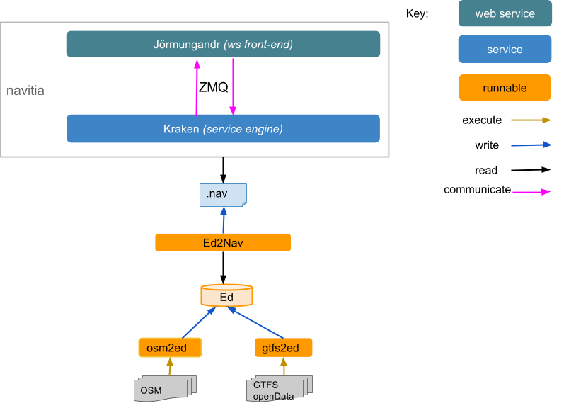

******************************
How to build kraken and run it
******************************

Dependencies
============

#. C++

   * gcc 4.7 or newer
   * cmake
   * log4cplus
   * osmpbf (https://github.com/scrosby/OSM-binary)
   * boost (test, chrono, regex, system, serialization, date-time, thread, filesystem, iostreams, program-options)
   * popt
   * zeromq 2.2
   * libpqxx 3
   * libgoogle-perftools-dev (tcmalloc)
   * protobuf
   * proj
   * xmlto

#. Python

   * zmq
   * protobuf
   * pika (>=0.9.7)
   * psycopg2
   * sqlalchemy
   * flask-restfull (https://github.com/l-vincent-l/flask-restful) **patched version**
   * shapely
   * six
   * redis
   * dict2xml
   * Flask-SQLAlchemy (only for Tyr currently)
   * Celery (>=3.0)
   * kombu

#. Other

   * RabbitMQ
   * PostgreSQL (9.1+)
   * Redis server

Build instruction
=================

We hope you got the source code from git.

#. Get the submodules: at the root of project :

   ``git submodule update --init``

#. With CMake you can build in a repository different than the source directory.

   By convention, you can have one build repository for each kind of build.
   Create a directory where everything will be built and enter it
   ``mkdir release``
   ``cd release``

#. Run cmake

   ``cmake ../source``
   Note: il will build in debug mode. If you want to compile it as a release run
   ``cmake -DCMAKE_BUILD_TYPE=Release ../source``

#. Compile

   ``make -j4``
   Note: adjust -jX according to the number of cores you have

Testing
=======

#. Overview

#. Data configuration

   The data manager is called *ed*. It relies on GTFS and Open Street Map data centralized in a postgres database

#. Configure the postgres database

   #. Install the postgis extension http://postgis.net/docs/postgis_installation.html

      #. if your postgis version is newer than 2.0, just call create extention

         ``su postgres; #or the user you installed postgres with``
      
         ``psql -d yourdatabase -c "CREATE EXTENSION postgis;"``

      #. else call the init_db.sh script with a settings file. 

         Copy the file source/script/settings.sh and update it with your parameters

         ``su postgres; #or the user you installed postgres with``

         ``cd source/scripts;``

         ``./init_db.sh your_settings.sh``

         
   #. Update the database scheme (with the usual user, not with 'postgres' anymore)

      ``cd source/scripts;``

      ``./update_db.sh your_settings.sh``

#. Get some GTFS data. For instance from http://data.navitia.io

   Import them using the gtfs2ed tool

#. Get some Open Street Map data. For instance from http://metro.teczno.com/

   Import them using the osm2ed tool

#. Once *ed* has been loaded with all the data, you have to export the data for *Kraken* with the ed2nav tool

   This step will generate a compressed nav file that can be given as input to *Kraken*

#. Running the *Kraken* backend

   #. To run *Kraken*, you need to supply some parameters. You can give those parameters either via a file or via the command-line. By default you can take the documentation/examples/config/kraken.ini configuration file. The configuration file needs at least the path of the exported nav file and the zmq socket used to communicate with Jörmungandr. Run ``kraken --help`` to see the list of arguments

   #. Run *Kraken*. It should tell you what data it tries to load, and give some figures about the data

#. Running the *Jörmungandr* front-end. Note : this front-end is an API, and not oriented towards final users

   #. Edit if you want the Jormungandr.ini file.

      Note: If you want to put the file elsewhere, you can change the INSTANCES_DIR variable

      example file : ::

        [instance]
        # name of the kraken
        key = some_region
        # zmq socket used to talk to the kraken, should be the same as the one defined by the zmq_socket param in kraken
        socket = ipc:///tmp/default_kraken

   #. Give him the configuration file (by default it uses source/jormungandr/default_settings.py) and run it

      ``JORMUNGANDR_CONFIG_FILE=your_config.py python manage.py runserver``

   #. Grab a browser and open http://localhost:5000/v1/coverage/default_region
