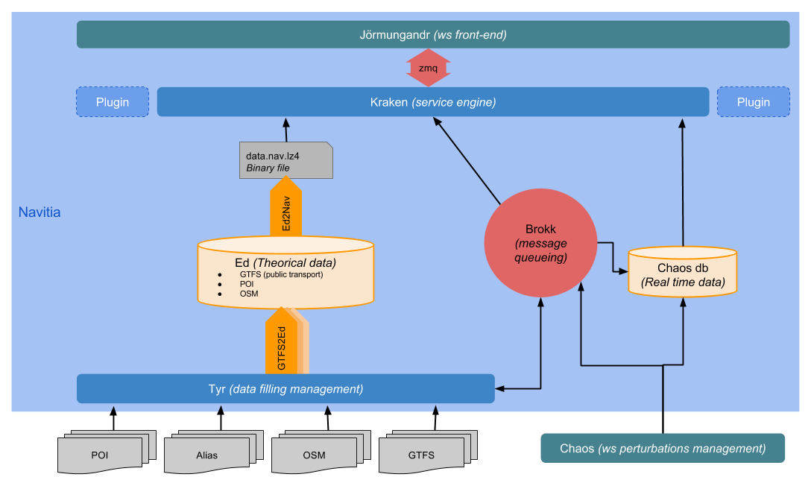

********
Navitia
********

.. image::  https://ci.navitia.io/buildStatus/icon?job=navitia_release
    :alt: build status
    :target: https://ci.navitia.io/job/navitia_release/

Presentation
============
This is the Navitia repository.

Navitia is a service providing:

#. multi-modal journeys computation

#. line schedules

#. next departures

#. explore public transport data

#. sexy things such as isochrones

The API can be found at http://api.navitia.io/

For more information see http://www.navitia.io/ or twitter @navitia or google groups navitia

Organisation
============
At the root of the repository, several directories can be found:

#. source: contains the navitia source code (c++ and python)

#. third_party: third party developped modules

#. documentation: all the navitia documentation

#. (debug|release): by convention, the build repositories

Architecture overview
=====================
Navitia is made of 3 main modules:

#. *Kraken* is the c++ core

#. *Jörmungandr* is the python frontend

#. *Ed* is the postgres database

*Kraken* and *Jörmungandr* communicate with each other through protocol buffer messages send by ZMQ.

Transportation data (in the `GTFS <https://developers.google.com/transit/gtfs/>`_ format) or routing data (from `OpenStreetMap <http://www.openstreetmap.org/>`_ for the moment) can be given to *Ed*. *Ed* produces a binary file used by *Kraken*.

Tools
======
#. Gcc as the C++ compiler (g++)

#. Cmake for the build system

#. Python for the api

#. Doxygen and swagger for the automated documentation

Installation
============
For the installation procedure, please refer to the `installation documentation <https://github.com/canaltp/navitia/blob/dev/install.rst>`_

You can also refer to the `automated build script <https://github.com/canaltp/navitia/blob/dev/build_navitia.sh` to have a step by step setup guide for ubuntu 14.04

How to contribute
=================
Fork the github repo, create a new branch from dev, and submit your pull request!

Alternatives?
=============
Navitia is written in python/c++, here are some alternatives:

* `OpenTripPlanner <https://github.com/opentripplanner/OpenTripPlanner/>`_ : the best known, written in java
* `rrrr <https://github.com/bliksemlabs/rrrr>`_ : the lightest one, written in python/c
* `Synthese <https://github.com/Open-Transport/synthese>`_ : a full stack, with CMS, written all in c++
* `Mumoro <https://github.com/Tristramg/mumoro>`_ : a R&D MUltiModal MUltiObjective ROuting algorithm
