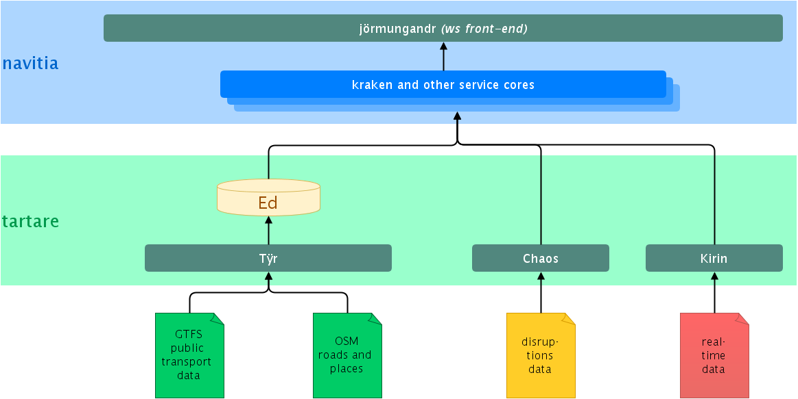

.. image:: https://navitia.com/content/uploads/sites/2/2021/10/kraken.png
    :alt: navitia
    :align: center

Cher membre de la communauté Navitia,

Nous vous remercions de l’intérêt que vous portez à nos produits et plus particulièrement à notre plateforme d’information voyageurs.

Nous avons le plaisir de vous informer qu’**une nouvelle version de Navitia sera prochainement disponible**.

Dans le cadre du lancement de cette nouvelle version, nous avons pris la décision de limiter l’accès à notre code source. Cette décision se traduit par la fermeture progressive d’ici à fin septembre de nos répertoires sur Github. Cette décision est avant tout motivée par le désir d’offrir à nos clients une meilleure qualité de services tant sur le plan fonctionnel que sur le plan des performances. Elle répond également à un certain nombre d’exigences en termes de cyber sécurité.

La version historique de Navitia, ouverte en 2014, restera disponible. Cette version est également disponible avec notre offre fremium via https://navitia.io , offre qui évoluera progressivement vers notre nouvelle version Navitia à partir de fin 2023.
Cette offre vous permet, sous certaines conditions, de disposer d’une assistance.

Notre service commercial sales@hove.com reste bien entendu à votre disposition pour vous étudier avec vous une formule adaptée à vos besoins.

Cordialement,
Hove

=========
 Navitia
=========
``(pronounce [navi-sia])``

.. |Version Logo| image:: https://img.shields.io/github/v/tag/hove-io/navitia?logo=github&style=flat-square
    :target: https://github.com/hove-io/navitia/releases
    :alt: version

..  |Build Status| image:: https://img.shields.io/github/workflow/status/hove-io/navitia/Build%20Navitia%20Packages%20For%20Release?logo=github&style=flat-square
    :target: https://github.com/hove-io/navitia/actions?query=workflow%3A%22Build+Navitia+Packages+For+Release%22
    :alt: Last build

.. |License| image:: https://img.shields.io/github/license/hove-io/navitia?color=9873b9&style=flat-square
    :alt: license

.. |Chat| image:: https://img.shields.io/matrix/navitia:matrix.org?logo=riot&style=flat-square
    :target: https://app.element.io/#/room/#navitia:matrix.org
    :alt: chat

.. |Code Coverage| image:: https://sonarcloud.io/api/project_badges/measure?project=Hove_navitia&metric=coverage
    :alt: SonarCloud Coverage

.. |Vulnerabilities| image:: https://sonarcloud.io/api/project_badges/measure?project=Hove_navitia&metric=vulnerabilities
    :alt: SonarCloud Vulnerabilities

.. |Security Rating| image:: https://sonarcloud.io/api/project_badges/measure?project=Hove_navitia&metric=security_rating
    :alt: SonarCloud Security Rating

+----------------+----------------+-----------+--------+-----------------+-------------------+-------------------+
| Version        | Build status   | License   | Chat   | Code Coverage   | Vulnerabilities   | Security Rating   |
+----------------+----------------+-----------+--------+-----------------+-------------------+-------------------+
| |Version Logo| | |Build Status| | |License| | |Chat| | |Code Coverage| | |Vulnerabilities| | |Security Rating| |
+----------------+----------------+-----------+--------+-----------------+-------------------+-------------------+

.. |Maintainability Rating| image:: https://sonarcloud.io/api/project_badges/measure?project=Hove_navitia&metric=sqale_rating
    :alt: SonarCloud Maintainability Rating

.. |Quality Gate Status| image:: https://sonarcloud.io/api/project_badges/measure?project=Hove_navitia&metric=alert_status
    :alt: SonarCloud Quality Gate Status

.. |Duplicated Lines (%)| image:: https://sonarcloud.io/api/project_badges/measure?project=Hove_navitia&metric=duplicated_lines_density
    :alt: SonarCloud Duplicated Lines (%)

.. |Reliability Rating| image:: https://sonarcloud.io/api/project_badges/measure?project=Hove_navitia&metric=reliability_rating
    :alt: SonarCloud Reliability Rating

.. |Bugs| image:: https://sonarcloud.io/api/project_badges/measure?project=Hove_navitia&metric=bugs
    :alt: SonarCloud Bugs

.. |Lines of Code| image:: https://sonarcloud.io/api/project_badges/measure?project=Hove_navitia&metric=ncloc
    :alt: SonarCloud Lines of Code

+--------------------------+-----------------------+------------------------+----------------------+--------+-------------------+
| Maintainability          | Quality Gate          | Duplicated Lines (%)   | Reliability          |  Bugs  |   Lines of Code   |
+--------------------------+-----------------------+------------------------+----------------------+--------+-------------------+
| |Maintainability Rating| | |Quality Gate Status| | |Duplicated Lines (%)| | |Reliability Rating| | |Bugs| |  |Lines of Code|  |
+--------------------------+-----------------------+------------------------+----------------------+--------+-------------------+

Presentation
============
Welcome to the Navitia repository!

Navitia is a webservice providing:

#. multi-modal journeys computation

#. line schedules

#. next departures

#. exploration of public transport data

#. search & autocomplete on places

#. sexy things such as isochrones

Approach
--------

| Navitia is an open-source web API, **initially** built to provide traveler information on urban
  transportation networks.
|
| Its main purpose is to provide day-to-day informations to travelers.
| Over time, Navitia has been able to do way more, *sometimes* for technical and debuging purpose
  *or* because other functional needs fit quite well in what Navitia can do *or* just because it was
  quite easy and super cool.
|
| Technically, Navitia is a HATEOAS_ API that returns JSON formated results.

.. _HATEOAS: https://en.wikipedia.org/wiki/HATEOAS

Who's who
----------

| Navitia is instanciated and exposed publicly through api.navitia.io_.
| Developments on Navitia are lead by Hove (previously Kisio Digital and CanalTP).
| Hove is a subsidiary of Keolis (itself a subsidiary of SNCF, French national railway company).

.. _api.navitia.io: https://api.navitia.io

More information
----------------

* main web site https://www.navitia.io
* playground https://playground.navitia.io
* integration documentation https://doc.navitia.io
* technical documentation https://github.com/hove-io/navitia/tree/dev/documentation/rfc
* twitter @navitia https://twitter.com/navitia

Getting started
===============

Want to test the API?
----------------------

| The easiest way to do this is a to go to `navitia.io <https://www.navitia.io/>`_.
| `Signup <https://navitia.io/inscription>`_, grab a token, read the `doc <https://doc.navitia.io>`_
  and start using the API!

For a more friendly interface you can use the API through
`navitia playground <https://playground.navitia.io/>`_ (no matter the server used).

Want to dev and contribute to navitia?
---------------------------------------

If you want to build navitia, develop in it or read more about technical details please refer to
`CONTRIBUTING.md <https://github.com/hove-io/navitia/blob/dev/CONTRIBUTING.md>`_.

Curious of who's contributing? :play_or_pause_button: https://www.youtube.com/watch?v=GOLfMTMGVFI

Architecture overview
=====================
Navitia is made of 3 main modules:

#. *Kraken* is the c++ core (Heavy computation)

#. *Jörmungandr* is the python frontend (Webservice and lighter computation)

#. *Ed* is the postgres database (Used for preliminary binarization)

*Kraken* and *Jörmungandr* communicate with each other through protocol buffer messages sent by ZMQ.

| Transportation data (in the `NTFS <https://github.com/hove-io/ntfs-specification/blob/master/readme.md>`_,
  or `GTFS <https://developers.google.com/transit/gtfs/>`_ format) or routing data
  (mainly from `OpenStreetMap <https://www.openstreetmap.org/>`_ for the moment) can be given to *Ed*.
| *Ed* produces a binary file used by *Kraken*.

More information here: https://github.com/hove-io/navitia/wiki/Architecture

Alternatives?
=============
Navitia is written in C++ / python, here are some alternatives:

* | `OpenTripPlanner <https://github.com/opentripplanner/OpenTripPlanner/>`_ : written in java.
  | More information here https://github.com/hove-io/navitia/wiki/OpenTripPlanner-and-Navitia-comparison.
* `rrrr <https://github.com/bliksemlabs/rrrr>`_ : the lightest one, written in python/c
* `Motis <https://github.com/motis-project/motis>`_ : Multi objective algorithm similar to Navitia in its approach
* `Mumoro <https://github.com/Tristramg/mumoro>`_ : an R&D MUltiModal MUltiObjective ROuting algorithm
